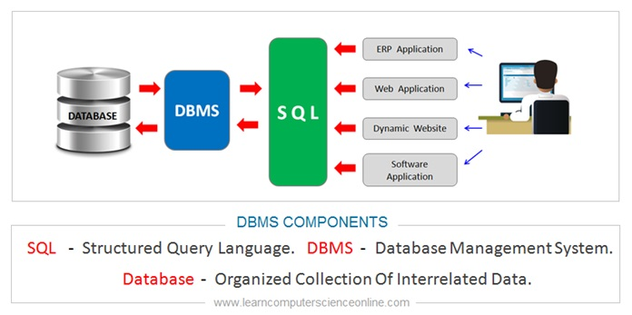

# 认识数据库

## 基本概念

数据库体系包含三个基本概念：

1. 数据库（DataBase，简称DB）：存储数据的仓库，数据是有组织的进行存储。
2. 数据库管理系统（DataBase Management System，简称DBMS）：操纵和管理数据库的大型软件。
3. SQL（Structured QueryLanguage）：操作关系型数据库的编程语言，定义了一套操作**关系型数据库**统一标准。

[主流数据库管理系统的市场占有率排名](https://db-engines.com/en/ranking)

