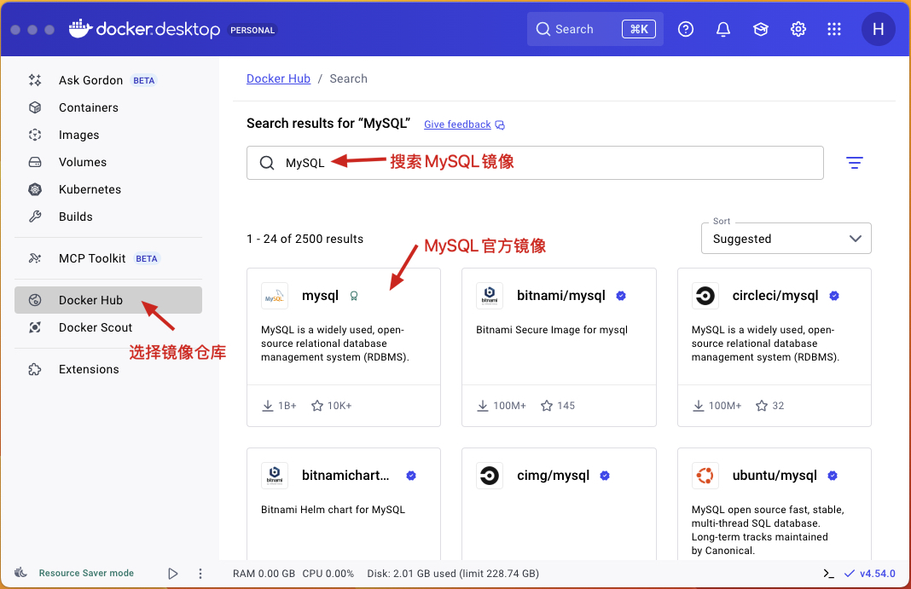
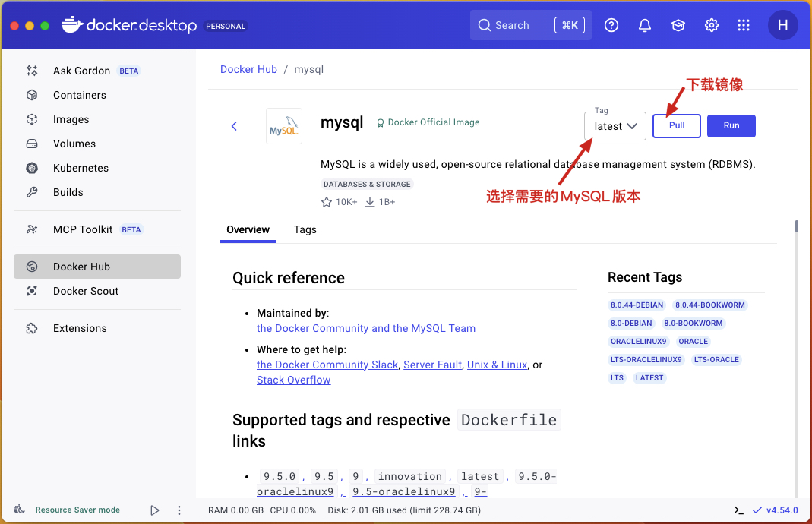
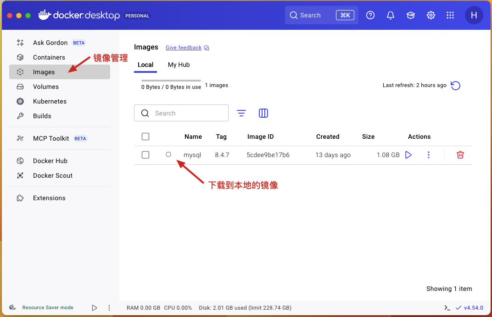
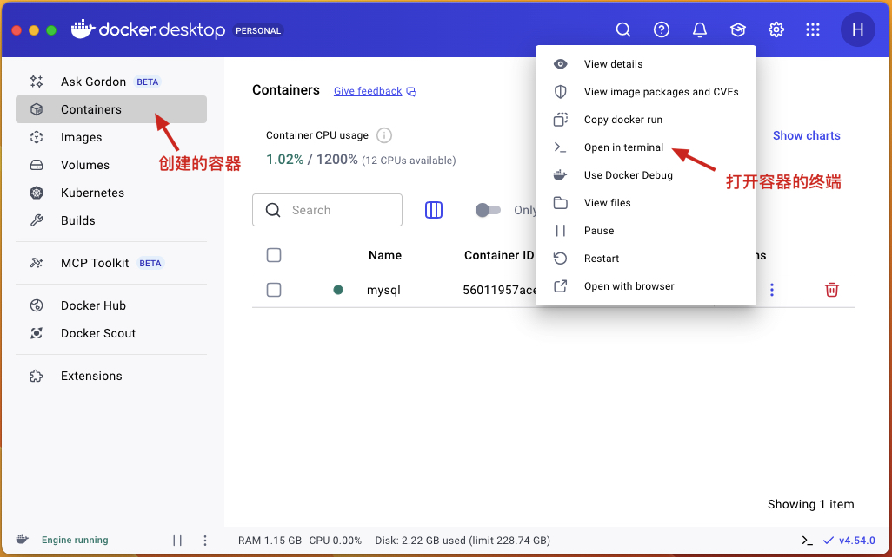
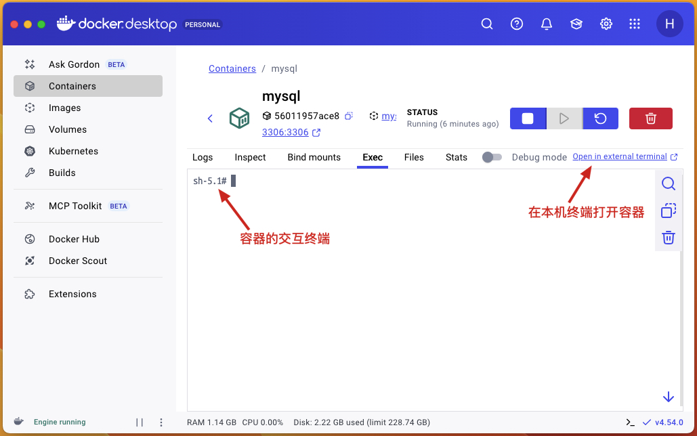
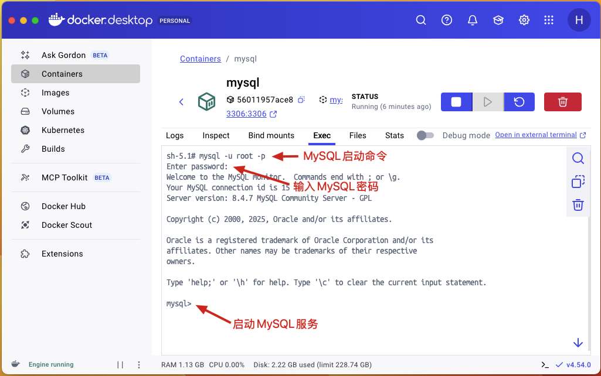

# MySQL的安装

[MySQL](https://www.mysql.com/)官方提供了两种不同的版本

* 社区版（MySQL Community Server）：免费，不提供任何技术支持。
* 商业版（MySQL Enterprise Edition）：收费，官方提供技术支持。

MySQL网站提供了不同版本的安装程序，包括：Windows、Linux或MacOS。本教材使用Docker来安装MySQL。

## MySQL安装与启动

在Docker Hub中搜索MySQL镜像



选择需要的MySQL版本



查看镜像软件



创建MySQL容器

```shell
docker run --name mysql -e MYSQL_ROOT_PASSWORD=123456 -p 3306:3306 -d mysql:8.4.7
```

* `--name mysql`设置容器的名称。
* `-e MYSQL_ROOT_PASSWORD=123456`设置数据库的密码。
* `-p 3306:3306`设置端口号。
* `-d mysql:8.4.7`使用镜像的版本。

查看MySQL容器



运行镜像终端



在镜像终端中启动MySQL命令行

```shell
mysql -u root -p
```

* `-u root`MySQL数据库用户名。
* `-p`MySQL数据库用户名对应的密码。



使用`exit`可以退出MySQL命令行工具。
