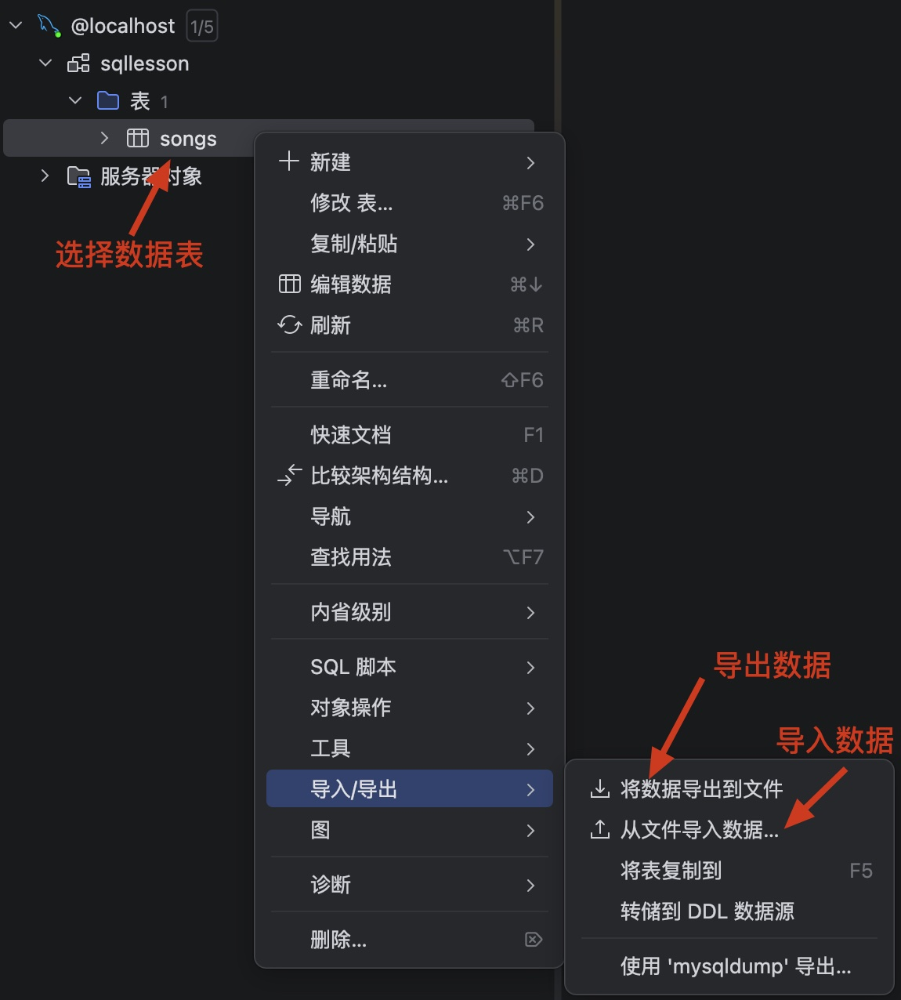

# 查询数据表

在数据库服务中，查询操作是最多的操作，其频率远超于增删改。在查询的过程中，通常还会伴随到条件、排序、分页等操作。查询语句的关键字为`select`。

为了演示查询操作，首先需要导入批量数据，数据文件保存在`\codes\mysql\songs_data_v1.csv`，使用DataGrip导入文件中的数据



## 基本语法

标准查询语句如下

```sql
SELECT        # 字段列表
FROM          # 表名列表
WHERE         # 条件列表
GROUP BY      # 分组字段列表
HAVING        # 分组后条件列表
ORDER BY      # 排序字段列表
LIMIT         # 分页参数
```

### 基础查询

查询指定字段

```sql
select id, title, audio_format, file_url from songs;
```

查询全部字段

```sql
select * from songs;
```

> [!warning]
>
> `*`号查询所有字段，在实际开发中尽量少用，主要是不直观、影响效率。

给字段设置别名

```sql
select id, title as '歌名', audio_format as '文件格式' from songs;
```

设置别名的简写方式

```sql
select id, title '歌名', audio_format '文件格式' from songs;
```

去除重复记录

```sql
select distinct audio_format from songs;
```

* `distinct`去除查询结果中的完全重复行。

### 条件查询

```sql
select id, title, duration from songs where duration >= 300;
```

* `where duration >= 300`选择`duration`大于300秒的歌曲。

查询条件中，可以使用运算符

| 运算符                | 功能                                           |
| --------------------- | ---------------------------------------------- |
| `>`                   | 大于                                           |
| `>=`                  | 大于等于                                       |
| `<`                   | 小于                                           |
| `<=`                  | 小于等于                                       |
| `=`                   | 等于                                           |
| `<>`或`!=`            | 不等于                                         |
| `between ... and ...` | 在某个范围之内（含最小、最大值）               |
| `in (...)`            | 在in之后的列表中的值，多选一                   |
| `like`                | 模糊匹配（`_`匹配单个字符，`%`匹配任意个字符） |
| `is null`             | 是NULL                                         |

查询不是MP3的歌曲

```sql
select id, title, audio_format from songs where audio_format != 'mp3';
```

查询时长在280到300之间的歌曲

```sql
select id, title, duration from songs where duration between 280 and 300;
```

查询`'wav'`、`'m4a'`和`'wav'`这三种格式的数据

```sql
select id, title, audio_format from songs where audio_format in ('wav', 'm4a', 'wav');
```

查询名字是两个字的歌曲，`_`匹配任意一个字符。

```sql
select id, title from songs where title like '__';
```

查询名字中有“天”字的歌曲，`%`匹配任意多个字符。

```sql
select id, title from songs where title like '%天%';
```

查询`file_url`文件路径是空的记录有多少

```sql
select id, title, file_url from songs where file_url is null;
```

查询条件中，可以使用逻辑运算符

| 运算符        | 逻辑 | 描述                   |
| ------------- | ---- | ---------------------- |
| `and` 或 `&&` | 与   | 两个条件都为真，则为真 |
| `or` 或 `||`  | 或   | 一个条件为真，则为真   |
| `not` 或 `!`  | 非   | 对条取反               |

查询名字中有“天”字，且只有两个字的歌曲

```sql
select id, title from songs where title like '%天%' and title like '__';
```

查询名字有三个字或两个字的歌曲

```sql
select id, title from songs where title like '___' or title like '__';
```

> [!note]
>
> 查询条件的优先级：
>
> 1. 优先级顺序从高到低：小括号、`not`、比较运算符、逻辑运算符。
> 2. `and`和`or`同时出现时，`and`优先级比`or`高。

### 聚合函数

聚会函数主要用于，对于数据进行统计，将一列数据作为一个整体，进行纵向计算。

> [!warning]
>
> 使用聚会函数后，看不到原始数据，只能看到统计结果。

常用的聚合函数

| 函数  | 功能     |
| ----- | -------- |
| count | 统计数量 |
| max   | 最大值   |
| min   | 最小值   |
| avg   | 平均值   |
| sum   | 求和     |

聚会函数的标准语法

```sql
select   # 聚会函数
from     # 表名
```

统计数据总数

```sql
select count(*) from songs;
```

统计`audio_format`非空的数据数量

```sql
select count(audio_format) from songs;
```

统计歌曲平均时长

```sql
select avg(duration) from songs;
```

统计歌曲的最长事件和最短时间

```sql
select max(duration) from songs;
select min(duration) from songs;
```

统计包含“天”字的歌曲，总体的时长是多少

```sql
select sum(duration) from songs where title like '%天%';
```

### 分组查询


### 排序查询


### 分页查询


### 执行顺序


### 综合案例
