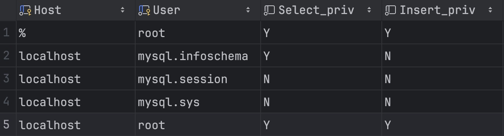

# 数据库控制与函数

## 数据库控制

数据库控制主要用来管理数据库用户、控制数据库的访问权限。MySQL中的所有用户保存在`mysql`数据库下`user`，查询用户表

```sql
select * from mysql.user;
```

> [!warning]
>
> `mysql` 数据库是系统数据库，无论当前位于哪个数据库都可以访问。

权限查询结果



* Host字段表示当前用户访问的主机
  * `localhost`代表只能够在当前本机访问，不可以远程访问的。
  * `%`代表可以从任意地址访问。
* User字段表示访问该数据库的用户名。
* 在MySQL中需要通过Host和User来唯一用户。

### 用户管理

创建用户

```sql
create user 'harry'@'localhost' identified by '123456';
```

创建后使用DataGrip链接数据库

```sql
create user 'harry'@'%' identified by '123456';
```

修改用户的密码

```sql
alter user 'harry'@'%' identified by '12345'
```

删除用户

```sql
drop user 'harry'@'localhost';
```

### 权限控制


## 函数

### 字符串函数

### 数值函数

### 日期函数

### 流程函数


