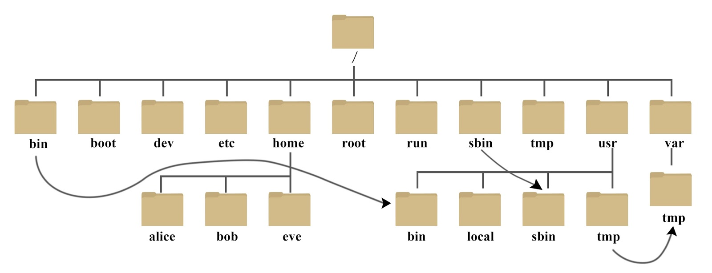

# 操作系统

操作系统（Operating System, OS）是管理计算机硬件与软件资源的“管家”，也是用户与计算机硬件之间的“桥梁”。

操作系统的核心功能：

* 进程管理（处理器管理）：决定哪个程序在什么时候使用 CPU。
* 内存管理：负责分配和回收内存空间。
* 文件系统管理：负责数据的存储与组织。
* 设备管理：协调键盘、鼠标、显示器、声卡等外部设备。

操作系统的分类

1. 个人电脑

   * Windows（最普及的操作系统）

   * 苹果电脑macOS（适合于开发人员）
   * Linux（应用软件少）

2. 服务器操作系统

   * Linux主流操作系统，安全、稳定、免费
   * Windows Server

3. 嵌入式操作系统
   * Linux
   
   * iOS
   * Android（基于Linux）

## Linux的发展史

### Unix系统

1. 在 20 世纪 60 年代中期，贝尔实验室（Bell Labs）、麻省理工学院（MIT）和通用电气（GE）联合开发一个名为 **Multics** 的宏大项目，意图构建一个支持多用户的庞大操作系统。

2. 1969 年，由于项目过于复杂且进展缓慢，贝尔实验室撤出了该项目。
3. 1969年从这个项目中退出的肯-汤普逊（Ken Thompson），为了让一台空闲的电脑上能够运行"星际旅行" 游行，用了 1 个月的时间，使用汇编写出了Unix操作系统的原型。
4. 1970年，肯-汤普逊以BCPL语言为基础，设计出很简单且很接近硬件的B语言，并且用B语言写了第一个UNIX操作系统。
5. 1971 年，丹尼斯-里奇（Dennis M.Ritchie）加入了肯-汤普逊的开发项目，合作开发 UNIX。他的主要工作是改造B语言，用于操作系统的开发。
6. 1972 年，丹尼斯-里奇在B语言的基础上最终设计出了一种新的语言，取名为C语言。
7. 1973年初，C语言的主体完成，肯-汤普逊和丹尼斯-里奇用它完全重写了Unix操作系统。

8. 此后由于AT&T受反垄断法限制，不能从事计算机业务，以极低的价格（甚至免费）将Unix源码授权给大学使用，Unix在大学中迅速扩散。
9. 80年代初，随着Unix商业价值的凸显，AT&T开始收回Unix的版权，禁止在教学中使用源码。
10. 进入90年代，面对商业Unix的封闭和昂贵，社区开始寻求替代方案，但是进展缓慢。
11. 乔布斯带领苹果公司基于BSD发展出，macOS和iOS的核心。

### Minix

1. 荷兰阿姆斯特丹自由大学的安德鲁-塔能鲍姆（Andrew S. Tanenbaum），为了让学生能深入理解操作系统的底层原理，塔能鲍姆教授决定仿照Unix的功能，从头编写一个不包含任何AT&T代码的小型操作系统。
2. Minix避免了版权上的争议。

### Linux

1. 1991年李纳斯（Linus）就读于赫尔辛基大学期间，尝试着在Minix上做一些开发工作。
2. 因为Minix仅用于教学且功能受限，李纳斯用了一个月的时间开发Linux内核，1991年9月Linux发布。
3.  李纳斯决定将Linux采用GPL自由软件协议发布。这意味着任何人都可以修改、分发代码，但必须保持开源。
4. 由于Linux这种开源、免费的策略使得Linux迅速发展起来。
5. 从2010年，随着移动端和云技术的迅速发展，Linux成为这两个领域的霸主。

> [!warning]
>
> 由于Linux操作系统源于Unix，所以它们在90%的操作是兼容的。而Linux操作系统和MacOS的操作也基本兼容。

## Linux内核及发行版

Linux内核是操作系统内部操作和控制硬件设备的核心程序，它是由芬兰人林纳斯（Linus）开发的。

Linux 发行版是Linux内核与各种常用软件的组合产品，即为常说的 Linux 操作系统。

* Ubuntu
* CentOS
* Redhat

## Ubuntu操作系统

Ubuntu操作系统是属于Linux操作系统中的一种，它是免费、稳定且有可视化界面，是 Linux 初学者常用的操作系统。 

## Linux内核及发行版

Linux 内核是操作系统内部操作和控制硬件设备的核心程序，它是由芬兰人林纳斯（Linus）开发的。

Linux 发行版是Linux内核与各种常用软件的组合产品，即为常说的 Linux 操作系统。

* Ubuntu
* CentOS
* Redhat

## Linux 系统目录结构

主要目录说明：

* /：根目录
* /bin：可执行二进制文件的目录
* /etc：系统配置文件存放的目录
* /home：用户家目录

## Linux 命令

linux 主要是使用命令行来操作

