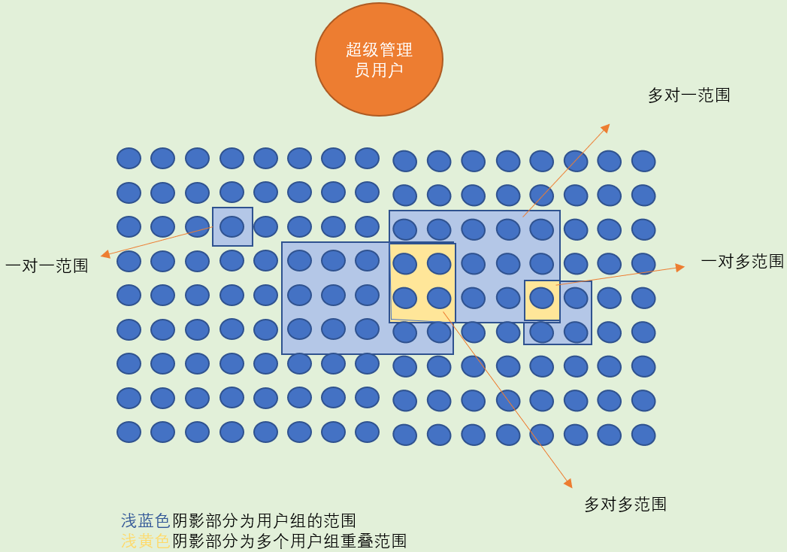
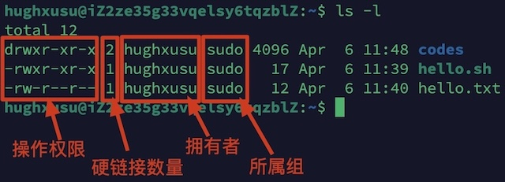
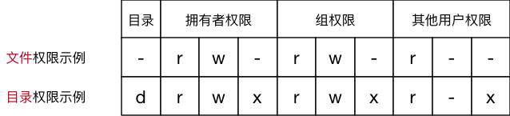
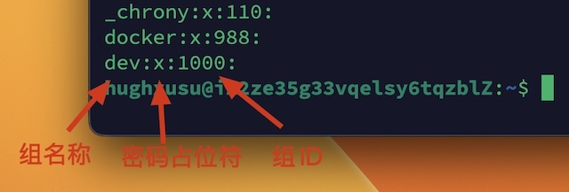

# 用户与权限管理

在Linux系统中，不论是由本机或是远程登录，都必须有一个账号，并且对于不同的系统资源拥有不同的使用权限，系统资源包括：文件和目录、网络资源（端口访问）、安装和执行软件等。用户权限包括

| 权限 |  英文  | 缩写 | 数字代号 |
| :--: | :----: | :--: | :------: |
|  读  |  read  |  r   |    4     |
|  写  | write  |  w   |    2     |
| 执行 | excute |  x   |    1     |

用户组（User Group）是一种将多个用户集合在一起，以便统一分配权限的逻辑机制。

1. 预先针对用户组设置好权限。
2. 将不同的用户添加到对应的组中。
3. 不用依次为每一个用户设置权限。

用户和用户组的关系



## 权限管理

使用`ls -l`可以查看文件夹下文件的详细信息



* 权限：操作文件或文件夹的权限，包括：读、写和执行。
* 硬链接数：有多少种方式，可以访问到当前目录。
* 拥有者：哪个用户创建了文件或目录。
* 用户组：文件属于哪个组。

> [!warning]
>
> 文件的拥有者可以不属于该文件的所属组。

权限信息表示



### 修改文件权限

使用`chmod`可以修改用户对文件或目录的权限

```shell
chmod [+|-]rwx [文件名|目录名]
```

* `+`表示添加权重，`-`表示删除权限。
* `rwx`表示修改的权限。

1. 修改文件可执行权限

```shell
chmod +x hello.sh
```

2. 移除文件可读权限

```shell
chmod -r hello.sh 
```

3. 修改目录可执行权限，如果文件夹没有可以执行权限，就无法进入。

```shell
chmod -x codes
```

4. 移除目录的读写权限，目录可以访问，但无法查看文件，添加文件。

```shell
chmod -rw codes
```

### 超级用户

Linux中的超级管理员用户称为root用，root用户对于操作系统的所有资源具有所有操作权限。除root用户外的其它用户，称为标准用户。标准用户执行系统管理相关命令，如：添加用户、安装软件需要借助`sudo`命令。

`sudo`允许标准用户执行系统操作命令

* `sudo`操作需要输入用户自己的密码，之后有5分钟的有效期限，超过期限则必须重新输入。
* 所有`sudo`执行的命令都会被记录在日志中，方便日后追溯。
* 若其未经授权的用户企图使用`sudo`，可以发出警告邮件给管理员。

## 用户组管理

组管理的操作属于系统操作，需要使用`sudo`命令

`groupadd`命令可以添加组

```shell
#     命令     组名
sudo groupadd dev
```

查看创建的组信息

```shell
cat /etc/group
```



> [!warning]
>
> `/etc`文件夹中保存配置相关文件，包括：组信息、用户信息和密码信息等。

使用`chgrp`命令可以修改文件或目录的所属组

```shell
#    命令      组  文件或目录
sudo chgrp -R dev codes/
```

## 用户管理

