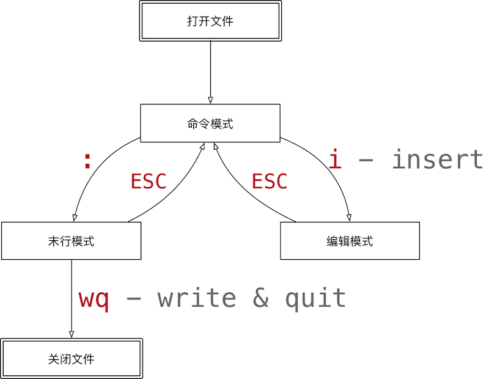

# 其它命令

## 安装软件

在Linux系统中安装、更新和卸载软件可以通过`apt`（Advanced Packaging Tool）命令。

1. `install`参数安装软件

```shell
sudo apt install sl
```

2. `upgrade`参数更新已安装的包

```shell
sudo apt upgrade sl
```

3. `remove`参数卸载软件包

```shell
sudo apt remove sl
```

### 配置软件源

Ubuntu中`apt`命令下载软件服务器一般位于国外，为了提高软件下载的速度，可以设置软件服务器的镜像源，阿里云ECS的镜像源一般已经设置好了。可以通过`/etc/apt/sources.list`文件查看

```shell
cat /etc/apt/sources.list
```

## 查询系统信息

### 查看时间和日期

1. 查看系统时间

```shell
date
```

2. 查看日历

```shell
cal -y
```

* `-y`选项可以查看一年的日历。

### 磁盘信息

1. 显示磁盘剩余空间，`-h`以人性化的方式显示文件大小。

```shell
df -h
```

2. 显示目录下的文件大小

```shell
du -h
```

### 进程信息

进程是操作系统中正在执行的程序，进程可以有前台和后台两种形式存在。一般情况下，系统服务都是后台进程。

1. 查看进程的详细状况

```shell
ps aux 
```

* `a`显示终端上的所有进程，包括其他用户的进程。
* `u`显示进程的详细状态。
* `x`显示没有控制终端的进程。


2. 强制终止进程

```shell
sudo kill -9 50447
```

* `-9`表示强行终止进程。
* `50447`进程ID。

> [!alert]
>
> 使用`kill`命令时，不要终止以`root`身份开启的进程，否则可能导致系统崩溃。

3. `top`命令可以动态显示运行中的进程并且排序，退出`top`命令输入`q`。

## 查找文件

`find`通常用来在特定的目录下，搜索符合条件的文件。

```shell
find -name *.sh
```

* `-name *.sh`要搜索到文件名，支持通配符。
* 从当前路径开始搜索。

指定搜索路径

```shell
find ./codes/ -name 'hello.*'
```

* `./codes/`指定搜索的路径。

## 软连接与硬链接

使用`ln`命令可以创建为文件创建一个链接，链接的特性与源文件一致。

1. 参数`-s`表示创建软连接

```shell
ln -s codes/hello.sh echo.sh
```

2. 创建硬链接

```shell
ln codes/hello.sh hello.sh
```

软连接与硬链接的区别


3. 使用`ls -l`可以查看文件的链接

```shell
which vi
ls -l /usr/bin/vi
```

## 打包与压缩

打包和压缩是在客户端和服务器中传递文件的必要步骤。在Linux中使用`tar`命令可以完成打包和压缩的操作。

### 打包

打包一起的文件一般用`xxx.tar`表示，打包命令为

```shell
tar -cvf code.tar codes/
```

* `c`打包文件；`v`显示打包详细过程和进度；`f`指定打包后的文件名，必须放选项最后。
* `code.tar`打包后的文件名。
* `codes/`被打包的文件夹。

```shell
tar -xvf code.tar -C tars
```

* `-x`解包文件；
* `code.tar`要解压的压缩包。
* `-C`解包到指定目，注意这个目录必须存在。如果不指定这个参数，解包到当前目录。

### 压缩

`gzip`压缩格式是在打包的基础上对数据进行压缩，使用`z`参数表示压缩为`gzip`格式，`gzip`的格式后缀名为`xxx.tar.gz`。

```shell
tar -zcvf code.tar.gz codes/
```

* `-zcvf`打包压缩一起执行，会现将文件压缩后再打包。

解压文件

```shell
tar -zxvf code.tar.gz -C gz/
```

`bzip2`压缩格式比`gzip`的压缩率更高，使用`j`参数表示压缩为`bzip2`格式，`bzip2`的格式后缀名为`xxx.tar.bz2`。

```shell
tar -jcvf code.tar.bz2 codes
```

解压文件

```shell
tar -jxvf code.tar.bz2 -C gz
```

## Vim编辑器

Vim和Vi是Linux下的文件编辑工具，可以用编辑代码、配置文件等文本文件，也可以通过`ssh`登陆到服务器上使用。Vim是Vi的进阶版，支持代码补全、编译等编程功能。在Ubuntu中`vi`是`vim`的软连接。Vim的特点：

* 没有图形界面的功能强大的编辑器。
* 只能是编辑文本内容，不能对字体、段落进行排版。
* 不支持鼠标操作，让程序员的手指始终保持在键盘的核心区域。

### 打开文件





