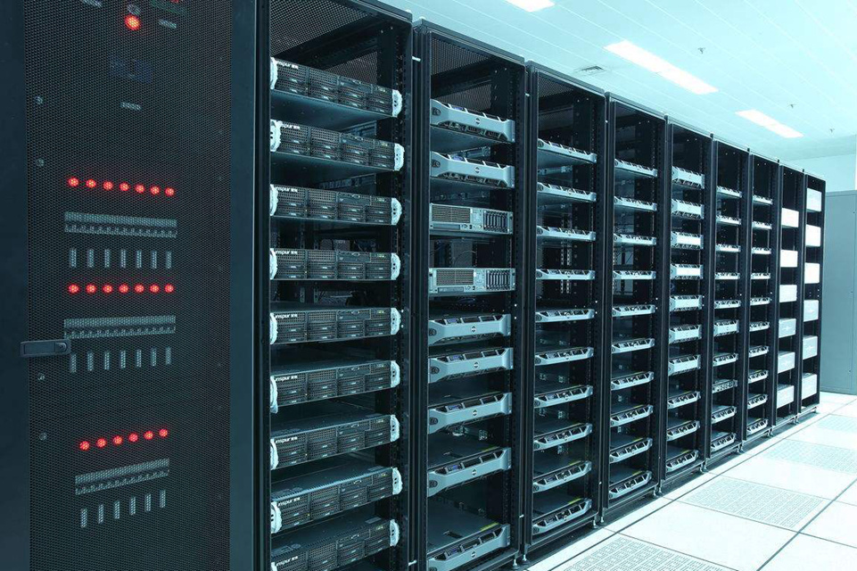

# 操作系统

操作系统（Operating System, OS）是管理计算机硬件与软件资源的“管家”，也是用户与计算机硬件之间的“桥梁”。

操作系统的核心功能：

* 进程管理（处理器管理）：决定哪个程序在什么时候使用 CPU。
* 内存管理：负责分配和回收内存空间。
* 文件系统管理：负责数据的存储与组织。
* 设备管理：协调键盘、鼠标、显示器、声卡等外部设备。

操作系统的分类

1. 个人电脑

   * Windows（最普及的操作系统）

   * 苹果电脑macOS（适合于开发人员）
   * Linux（应用软件少）

2. 服务器操作系统

   * Linux主流操作系统，安全、稳定、免费
   * Windows Server

3. 嵌入式操作系统
   * Linux
4. 移动设备操作系统
   * iOS
   * Android（基于Linux）

## Ubuntu操作系统

Ubuntu操作系统是属于Linux操作系统中的一种，它是免费、稳定且有可视化界面，是 Linux 初学者常用的操作系统。 

## Linux内核及发行版

Linux 内核是操作系统内部操作和控制硬件设备的核心程序，它是由芬兰人林纳斯（Linus）开发的。

Linux 发行版是Linux内核与各种常用软件的组合产品，即为常说的 Linux 操作系统。

* Ubuntu
* CentOS
* Redhat

## Linux 系统目录结构

主要目录说明：

* /：根目录
* /bin：可执行二进制文件的目录
* /etc：系统配置文件存放的目录
* /home：用户家目录

## Linux 命令

linux 主要是使用命令行来操作

