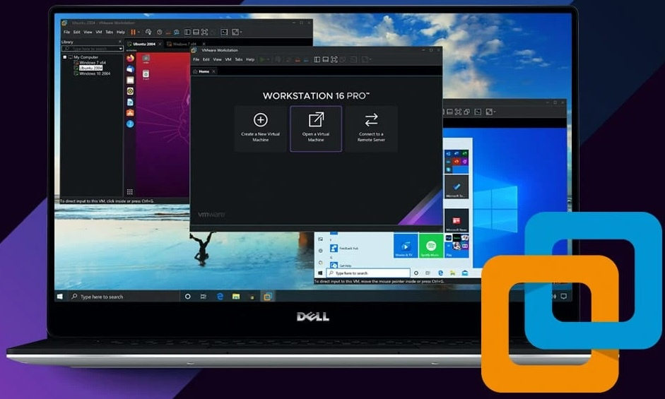
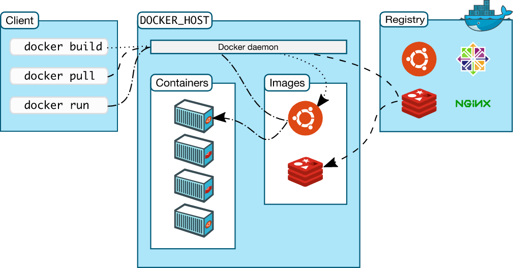
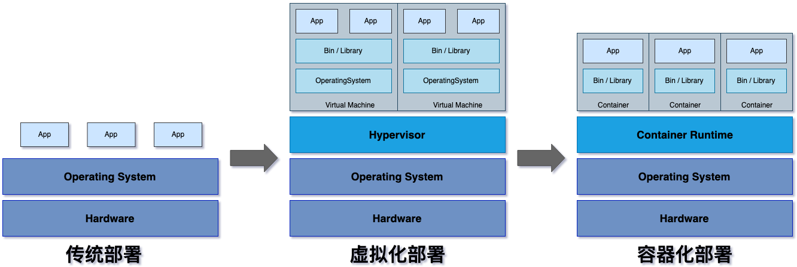
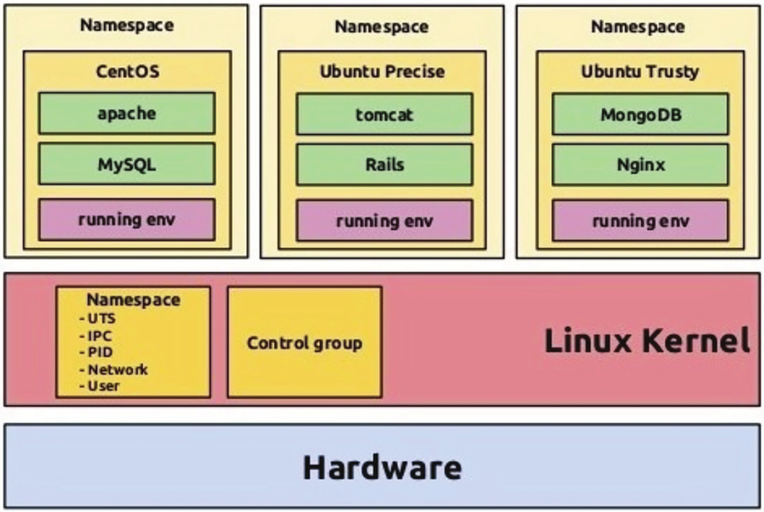
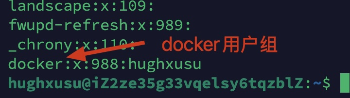

# 绪论

Docker是一种能够将应用程序及其所有依赖项打包成一个标准化单元的技术。

> [!think]
>
> 问什么要使用Docker？



Docker容器类似于常见的虚拟机技术，但其有如下特点：

1. 使用Docker确保了开发环境和部署环境的高度一致性，解决“在我的电脑上能跑，在你的电脑上不行”。
2. 环境极其轻量化，Docker容器直接运行在宿主机的内核之上，不需要额外的系统开销。
3. 容器之间是隔离的，容器里的程序会认为自己拥有独立的操作系统、文件系统、网络接口和进程树。如果A容器内的程序存在内存溢出导致程序崩溃，不会影响整台机器。
4. 快速部署与扩展，通过简单指令就可以快速部署数据库、web服务程序，省略的复杂的安装过程。


Docker技术应用的领域

1. 核心人员：计算机软件的开发工程师和运维工程师。
2. 数据科学家：在处理复杂的机器学习项目时，环境配置（如 CUDA、PyTorch、特定版本的 NumPy）非常痛苦。Docker镜像让研究人员可以轻松分享实验环境，保证科研成果的可复现性。
3. 发烧友：很多个人用户在家用服务器上使用Docker部署私人云盘、媒体服务器或智能家居系统等应用。

## Docker的架构

Docker系统主要有三部分分构成

1. 客户端（Docker Client）是用户与Docker交互的地方。
2. 宿主机（Docker Host）， 一个持续运行的后台进程，接收来自Client的请求，并负责管理所有的Docker 对象，如镜像、容器、网络和数据卷。
3. 仓库（Docker Registry），这是存放镜像的地方。




Docker官方维护的一个云端资源库[Docker hub](https://hub.docker.com/)，也是目前全球最大的容器镜像托管平台，这个平台类似于Github。

* 镜像托管：用户可以将己构建的镜像上传到这里，以便在其他机器或服务器上随时下载。
* 官方镜像：Docker官方会维护一套高质量、经过安全验证的镜像。

### 理解Docker容器

从传统部署到容器化部署



容器化部署和虚拟机的主要差别是，容器之间共享了操作系统的内核层，才带来了性能和体积上的质变。

* 容器里的进程在宿主机看来，本质上就是一个普通的进程，只是被加上了“隔离围栏”。
* 容器启动时，内核早已在宿主机上跑着了，它只是创建了一个隔离环境并启动进程



## Docker的安装

在本机或服务器上安装docker实际上是同时安装客户端和宿主机。

### 在云服务器上安装Docker

1. [获取阿里云服务器](/docs/a-linux/c-服务器?id=阿里云服务)

2. [在服务器上安装Docker](https://help.aliyun.com/zh/ecs/user-guide/install-and-use-docker?spm=5176.smartservice_service_robot_chat_new.console-base_help.dexternal.15cef625KG29k9&__dialog_id=577360379&__url_role=2&userCode=okjhlpr5#8dca4cfa3dn0e)


成功安装Docker后，Docker会给系统创建一个名为`docker`的用户组

```shell
cat /etc/group
```



如果希望用户可以使用Docker命令，可以将用户加入`docker`用户组

```shell
sudo usermod -G sudo docker
```

测试Docker命令是否可以执行

```shell
docker --version
```

### 在Mac安装Docker

[Docker软件下载](https://www.docker.com/products/docker-desktop/)


安装成功后启动Docker程序


设置服务器镜像


在引擎设置中添加如下内容

```json
{
  "builder": {
    "gc": {
      "defaultKeepStorage": "20GB",
      "enabled": true
    }
  },
  "experimental": false,
  "registry-mirrors": [
    "https://hub-mirror.c.163.com",
    "https://docker.1ms.run",
    "https://docker.xuanyuan.me"
  ]
}
```

> [!warning]
>
> 设置完成后需要退出Docker软件，重新启动。

重启后在终端中查看配置是否生效

```shell
docker info
```

终端中显示镜像信息如下

```shell
 Registry Mirrors:
  https://hub-mirror.c.163.com/
  https://docker.1ms.run/
  https://docker.xuanyuan.me/
```

表示镜像配置成功。