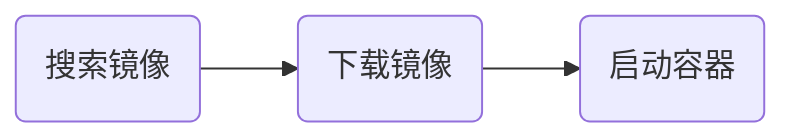
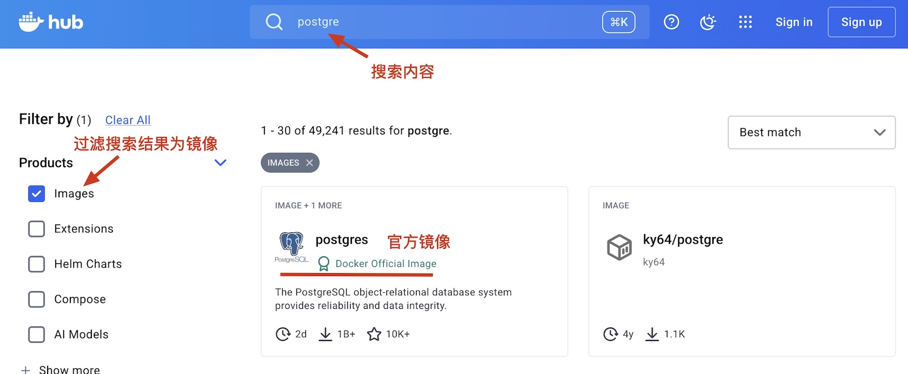
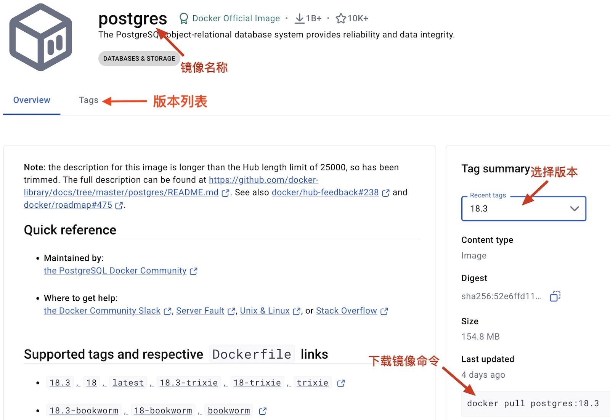

# 基本使用

Docker使用的基本流程



## 找到合适的镜像

[Docker hub](https://hub.docker.com/)是目前全球最大的容器镜像托管平台，用户可以在上面的到需要的镜像。



找到镜像后选择可以选择合适的版本



### 镜像操作

在命令行中搜索镜像，命令行搜索不会走镜像加速通道，所以搜索结果可能超时

```shell
docker search postgres
```

下载镜像最新版本镜像

```shell
docker pull postgres
docker pull postgres:latest
```

下载指定版本的镜像

```shell
docker pull postgres:18
```

查看下载成功的镜像

```shell
docker images
```

查看镜像的历史，可以查看安装的PostgreSQL，具体是哪个版本。

```shell
docker history postgres:18
```

移除已下载的镜像

```shell
docker rmi postgres:18
```


