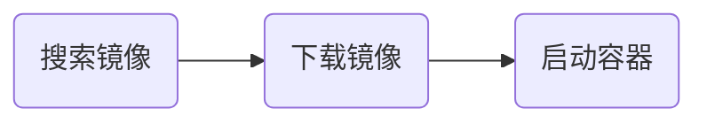
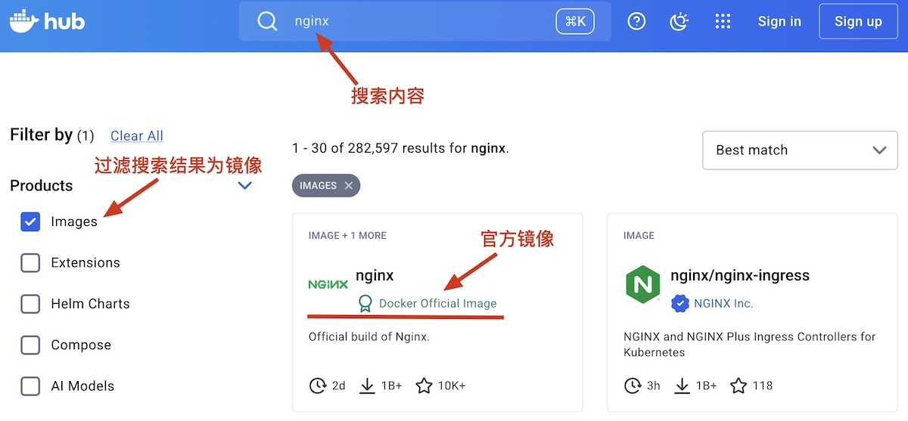
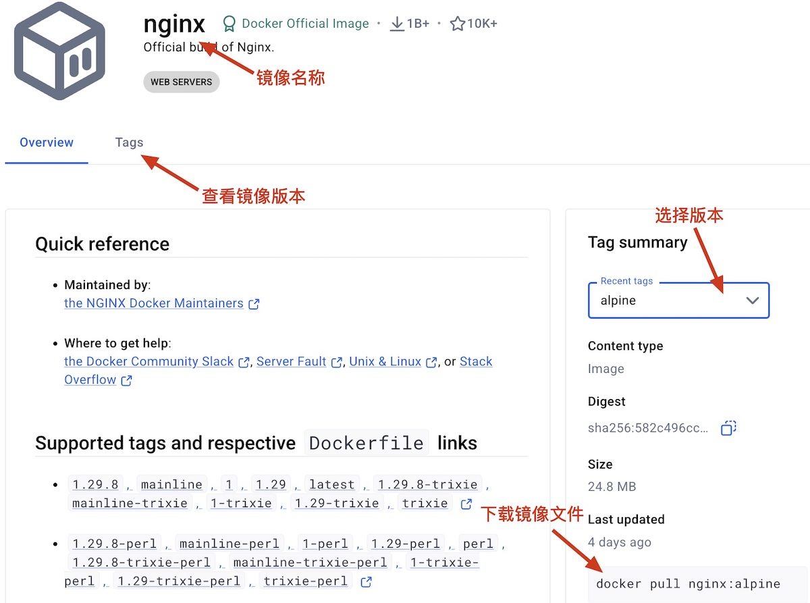

# 基本使用

Docker使用的基本流程



## 找到合适的镜像

[Docker hub](https://hub.docker.com/)是目前全球最大的容器镜像托管平台，用户可以在上面的到需要的镜像。



找到镜像后选择可以选择合适的版本



### 镜像操作

在命令行中搜索镜像，命令行搜索不会走镜像加速通道，所以搜索结果可能超时

```shell
docker search nginx
```

下载镜像最新版本镜像

```shell
docker pull nginx
docker pull nginx:latest
```

下载指定版本的镜像

```shell
docker pull nginx:alpine
```

查看下载成功的镜像

```shell
docker images
```

查看镜像的历史，可以查看安装的PostgreSQL，具体是哪个版本。

```shell
docker history nginx:alpine
```

移除已下载的镜像

```shell
docker rmi nginx:alpine
```

## 启动容器

容器是镜像的实例，镜像相当于软件安装包，容器相当于安装好的软件。用户的最终目标是使用软件，启动容器的过程可以看做是在安装软件。启动容器的命令为

```shell
docker run [OPTIONS] IMAGE [COMMAND] [ARG...]
```

* `[OPTIONS]`配置容器运行时的参数。
* `[COMMAND]`这是容器启动后默认执行的第一个程序。
* `[ARG...]`这是传递给的`[COMMAND]`具体参数。
* 对于服务型容器，镜像在制作时，已经将启动命令写入，`[COMMAND]`和`[ARG...]`不常用。


