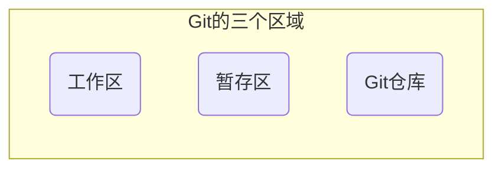
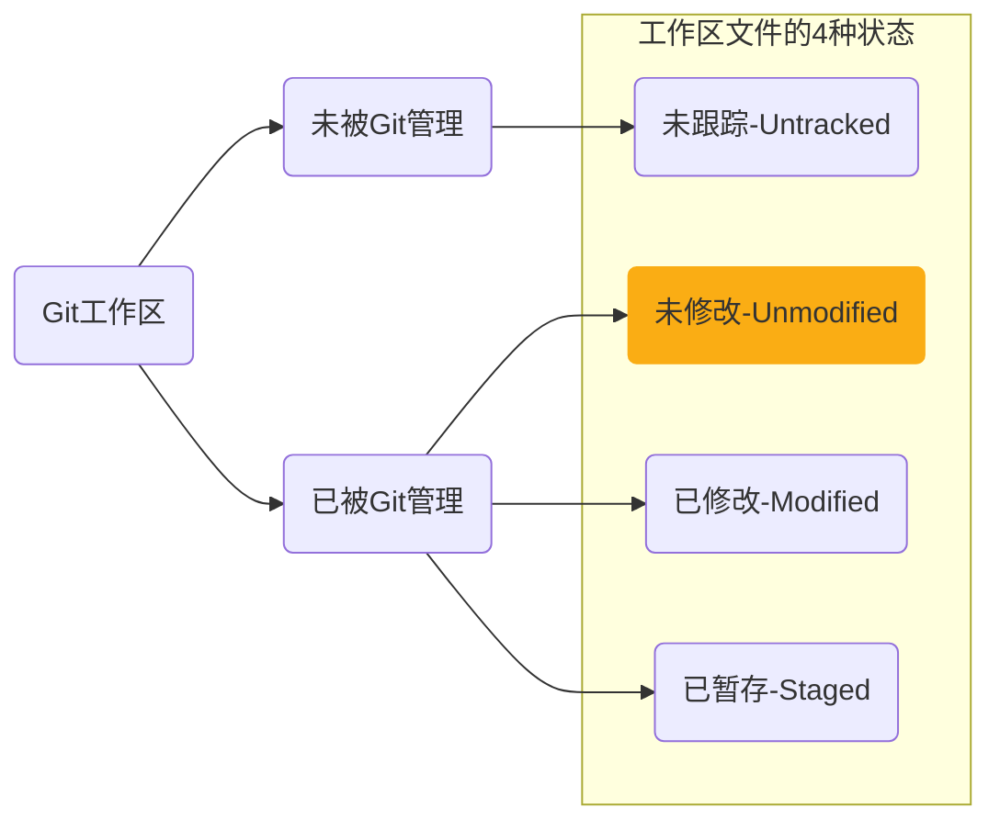
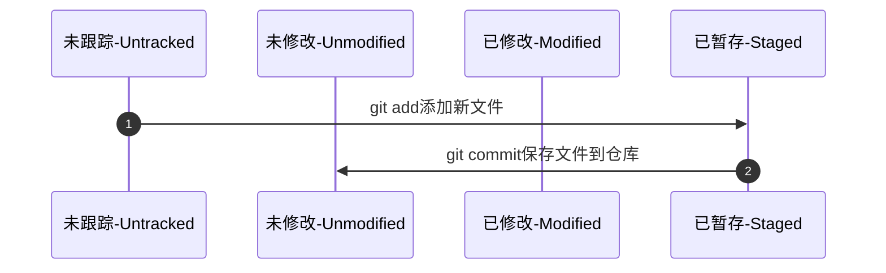
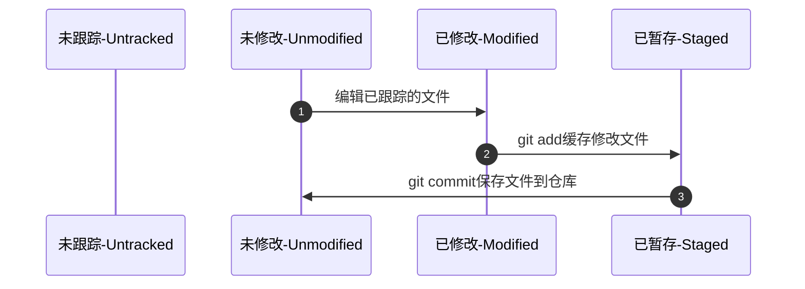
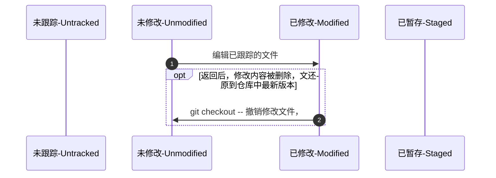
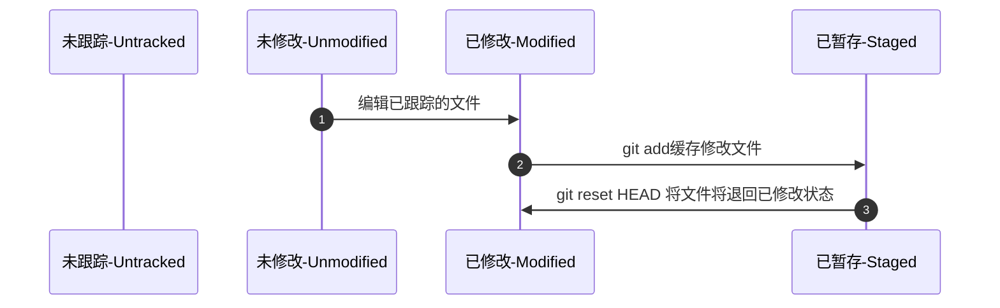
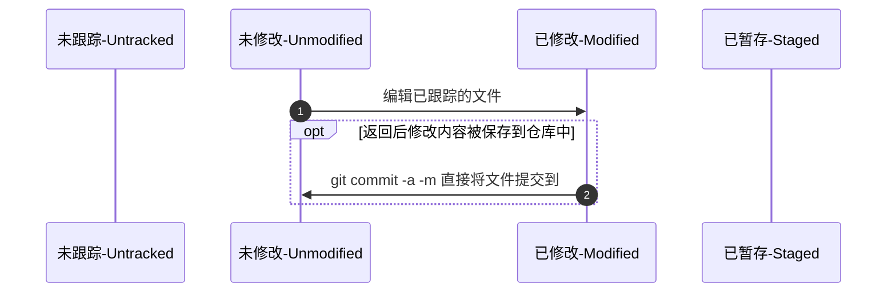
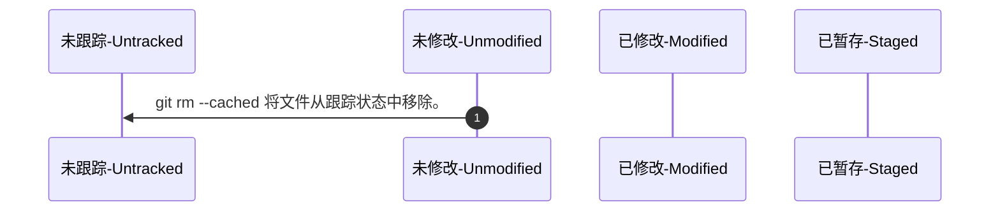

# Git基础

使用Git管理的项目，拥有三个区域，分别是工作区、暂存区、Git仓库。



1. 在工作区中修改文件。
2. 将确认修改完成的文件提保存暂存区。
3. 确认修改部分后，将暂存区的文件提交到Git仓库。

Git文件的三种状态：

1. 已修改：表示修改了文件，但还没将修改的结果放到暂存区。（工作区改动的文件）
2. 已暂存：表示对已修改文件的当前版本做了标记，使之包含在下次提交的列表中。（修改后放入暂存区的文件）
3. 已提交：表示文件已经安全地保存在本地的Git仓库中。（提交到Git仓库中的文件）

Git工作流


## Git的基本操作

### Git安装

[Git安装教程](https://git-scm.com/book/zh/v2/%e8%b5%b7%e6%ad%a5-%e5%ae%89%e8%a3%85-Git)

[Git的下载](https://git-scm.com/downloads)

### Git初始配置

1. 配置用户名和邮箱，使用如下命令可以配置用户名。

```shell
git config --global user.name harry
git config --global user.email harry@qq.com
```

> [!warning]
>
> Git通过用户名和邮箱，区分文件的修改者。
>
> `--global`是Git全局参数，所有Git仓库统一使用的信息。

配置好的用户信息会被写入**用户路径**下的`.gitconfig`文件中。

2. 使用命令查看全局配置信息。

```shell
# 查看所有全局配置项
git config --list --global

# 查看指定全局配置项
git config user.name 
git config user.email
```

[查询Git相关命令](https://git-scm.com/docs)

### 获取Git仓库

获取Git仓库的两种方式：

1. 将尚未进行版本控制的本地目录转换为Git仓库。
2. 从其它服务器克隆一个已存在的Git仓库。

### 初始化本地项目

在要使用Git管理的项目文件夹下，使用终端输入`git init`将当前的目录转化为Git仓库。

> [!warning]
>
> 在Windows系统中，通过鼠标右键打开Git Bash。

`git init`命令会创建一个名为`.git`的隐藏目录，这个目录就是当前项目的Git仓库，里面包含了初始的必要文件，这些文件是Git仓库的必要组成部分。

* Git的工作区就是当前的文件夹。
* 缓存区和Git仓库都在`.git`文件夹下，都不需要人为管理。

Git工作区文件的4种状态



1. 未跟踪：新建的文件和不需要Git管理的文件。
2. 未修改：工作区中和Git仓库中，内容保持一致的文件。
3. 已修改：工作区中和Git仓库中，内容不一致的文件。
4. 已暂存：工作区中被修改的文件已被放到暂存区，但还未提交到Git仓库。

> [!warning]
>
> Git操作的终极目标：让工作区中的文件都处于未修改的状态。

1. 查文件看状态报告

```shell
# 查看详细报告
git status

# 查看简单报告
git status -s
git status --short
```

* 默认新建的文件不会被Git管理，如果文件需要使用Git管理需要用户指定。

2. 跟踪新文件

```shell
git add .
```

* 新添加到暂存区中的文件前面有`A`标记。

3. 提交新跟踪的文件

```shell
git commit -m "添加文件"
```

* `-m`后面是提交记录，用于描述本次修改的内容。

新建文件提交流程



### 修改项目文件

修改项目中已跟踪的文件，文件会变为已修改状态，修改过且没有放入暂存区的文件前面有M标记。

1. 暂存修改文件：`git add .`可以将修改的文件放入暂存区。

2. 提交修改文件：`git commit -m "xxx"`提交修改文件。

修改文件提交流程



## 其他操作

### 撤销文件的修改

把对工作区中对应文件的修改，还原成Git仓库中所保存的版本。

```shell
git checkout -- hello.py
```

> [!attention]
>
> 撤销修改的文件必须是已修改，未缓存的文件。



### 向暂存区中添加多个文件

```shell
git add .
```

* 可以将修改的文件和新增的文件同时添加到暂存区。

### 移除暂存文件

```shell
reset HEAD student.py
```



### 过使用暂存区域

```shell
git commit -a -m "描述信息"
```



> [!attention]
>
> 未跟踪的文件无法跳过缓存区直接提交到仓库。

### 移除文件

从Git仓库中移除文件的方式有两种：

1.  从Git仓库和工作区中同时移除对应的文件。

```shell
git rm -f hello.py
```

2. 只从Git仓库中移除指定的文件，但保留工作区中对应的文件。

```shell
git rm --cached lesson.py
```



### 忽略文件

项目管理中总会有些文件无需纳入Git的管理，也不希望它们总出现在未跟踪文件列表中。 在这种情况下，可以创建一个名为`.gitignore`的配置文件，列出要忽略的文件的匹配模式。

* 以`#`开头的是注释 
* 以`/`结尾的是目录
* 以`/`开头防止递归
* 以`!`开头表示取反
* 可以使用`glob`模式进行文件和文件夹的匹配（`glob`指简化了的正则表达式）
  * `* `匹配零个或多个任意字符
  * `[abc]`匹配任何一个列在方括号中的字符
  * 问号`?`只匹配一个任意字符
  * 在方括号中使用短划线分隔两个字符， 表示所有在这两个字符范围内的都可以匹配（比如`[0-9]`表示匹配所有`0`到`9的数字）

```shell
# 忽略所有的 .a 文件
*.a

# 即使忽略所有的 .a 文件，但要跟踪 lib.a 文件
!lib.a

# 只忽略当前目录下的 TODO 文件，子目录的 TODO 文件不忽略 
/TODO

# 忽略任何目录下的 build 文件夹
build/

# 忽略 doc 目录下后缀为 .txt 的文件
doc/*.txt

# 忽略 doc 目录及其子目录下的 .pdf 文件
doc/**/*.pdf
```

### 查看提交历史

如何需要查看提交历史，使用`git log`命令

```shell
# 查看所有提交历史，倒序排列
git log

# 只展示最新两条提交历史
git log -2

# 使用一行展示最新的提交历史
git log -2 --pretty=oneline
```

`--pretty`可以控制展示格式

### 退回指定版本

```shell
git log --pretty=oneline

# 根据指定的提交ID回退到指定版本
git reset --hard <CommitID>

# 在旧版本中使用，查看完整提交历史历史
git reflog --pretty=oneline

# 跳转最新版本
git reset --hard <CommitID>
```


