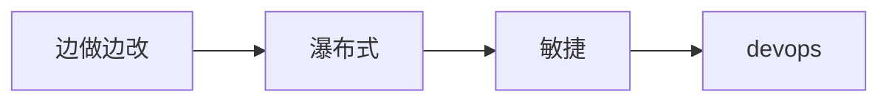
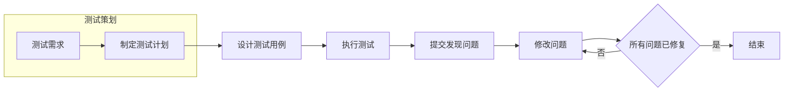
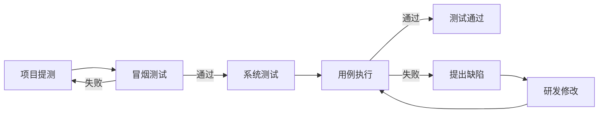

#  基本概念

## 软件

软件是计算机系统中与应急相互依存的另一部分，包括：程序、数据及相关文档的完整集合。

* 程序是按事先设计的功能和性能要求执行的指令序列。
* 数据时是使程序能正常操纵信息的数据结构。
* 文档是与程序开发、维护和使用有关的图文材料。

软件的十大特性：

1. 形态特性：无形的逻辑实体。
2. 智能特性：智力产品，解决计算、分析、判断和决策问题。
3. 开发特性：个人因素。
4. 质量特性：一定存在缺陷。
5. 生产特性：开发复杂，复制简单。
6. 管理特性。
7. 环境特性：对环境有不可摆脱的依赖性。
8. 维护特性：升级、优化和功能更新。
9. 废弃特性。
10. 应用特性：应用广泛。

软件的分类：

* 系统软件：操作系统、数据库等。
* 应用软件：完成特定功能，浏览器等。

软件的生命周期：

### 软件架构

所谓的软件架构我们可以理解为是用来指导我们软件开发的一种思想。 前来说最常见目的二种架构模式就是 B/S C/S 

* B（browser 浏览器）
* C（clent 客户端）
* S（server 服务端）

二种架构的比较

* 标准：相对于CS架构来说BS架构的二端都是在使用现成的成熟产品，所以BS会显示的标准一些。
* 效率：相对于BS架构来说CS中的客户端可以分担一些数据的处理，因此执行效率会高 一些。
* 安全：BS 架构当中的数据传输都是以HTTP协议进行的输出，而HTTP协议又是明文输出，可以被抓包。相对于CS架构来说BS就显得不那么安全。
* 升级： BS架构只需要在服务器端将数据进地更新， 前台只需要刷新页面就可以完成升级。CS 架构当中必须要将二端都进行更新。 
* 开发成本：相对于 BS 架构来说 CS 当中的客户端需要自已开发，所以相对于来说成本会高一些。

### 开发过程模型

#### 瀑布模型

* 是线性模型的一种，在所有模型中占有重要地位，是所有其他模型的一个基础。
* 每一个阶段执行一次，按线性顺序进行软件开发。
* 测试阶段处于软件实现后，必须在代码完成后留出足够的时间给测试活动，否则将导致测试不充分，很多问题到项目后期才暴露.

优点

* 开发的各个阶段比较清晰。
* 强调早期计划及需求调查。
* 适合需求稳定的产品开发。

缺点

* 依赖于早期的需求调查，不适应需求的变化。
* 单一流程不可逆。
* 风险往往延至后期才显露，失去及早纠正的机会。
* 问题在项目后期才开始暴露。
* 前面未发现的错误会传递并扩散到后面的阶段，可能导致项目失败。

#### 快速原型模型

在开发真实系统之前，构造一个原型，在该原型的基础上，逐渐完成整个系统的开发工作。

1. 建造一个快速原型，实现用户与系统的交互，用户对原型进行评价，进一步细化待开发软件的需求。通过逐步调整原型使其满足用户的要求，开发人员可以确定用户的真正需求是什么。
2. 在第一步的基础上开发出用户满意的软件产品。

优点：克服瀑布模型的缺点，更好地满足用户的需求并减少由于软件需求不明确带来的项目开发风险。适合预先不能确切定义需求的软件系统的开发。

缺点：不适合大型系统的开发（适合开发小型的、灵活性高的系统）。前提要有一个展示性的产品原型，因此在一定程度上可能会限制开发人员的创新。

#### 螺旋模型

螺旋模型将开发过程分为几个螺旋周期，每个螺旋周期大致和瀑布模型相符合，螺旋模型沿着螺旋线旋转，即在坐标的4个象限上分别表示了4个方面的活动：

* 制定计划
* 风险分析
* 实施开发
* 客户评估

优点：螺旋模型很大程度上是一种风险驱动的方法体系，因为在每个阶段之前及经常发生的循环之前，都必须首先进行风险评估。

缺点：采用螺旋模型需要具有相当丰富的风险评估经验和专门知识，在风险较大的项目开发中, 如果未能够及时标识风险，势必造成重大损失。过多的迭代次数会增加开发成本，延迟提交时间。

#### 敏捷模型

敏捷开发是一种以人为核心、迭代、循序渐进的开发方法。

特点：

* 短周期开发
* 增量开发
* 由程序员和测试人员编写的自动化测试来监控开发进度
* 通过口头沟通、测试和源代码来交流系统的结构和意图
* 编写代码前先写测试代码、测试先行。

### 软件开发文档

### 公司开发模型

* 211指标：小需求2周上线，开发周期1星期，回归测试和上线流程1小时。

## 软件测试

1. 思维定式：软件测试的思维是如何用某种奇葩的方式将软件用错。
2. 经典定义：在规定的条件下对程序进行操作，以发现程序错误，衡量软件质量，并对其是否能满足设计要求进行评估的过程。 
3. 标准定义：使用人工或自动化的手段来运行或测定某个软件系统的过程，其目的在于检验它是否满足规定的需求或弄清预期结果与实际结果之间的差别。
4. 目的：
   * 发现问题
   * 系统是否满足需求
5. 软件测试的两个维度：
   1. 正向：测试软件功能可用
   2. 逆向：寻找软件bug

### 测试的基本概念

#### 软件测试的原则

1. 所有测试都应该追溯到用户需求。
2. 测试证明软件存在缺陷：无论执行什么样的测试操作都保能证明当前软件是有缺陷的。 
3. 不能执行穷尽测试：有些功能是没有办法将所有的测试情况都逻列出来，所以任何的测操作都有结束时间。
4. 缺陷存在群集现象：对于软件功能说，核心功能占20%，非核心是80%。在实际工作中会集中测试20%的核心功能，所以这个部分发现缺陷的几率就会高于80%。即遇到缺陷都集中在20%功能模块里的现象。
5. 某些测试需要依赖特殊的环境。
6. 测试应尽早介入。
7. Pareto法则，在分析、设计、实现阶段的复审和测试能发现和避免80%的缺陷，在系统测试中有能找出其余缺陷的80%，最后的缺陷只有在用户大范围、长时间使用中才能被发现。
8. 杀虫剂现象：同样的一个测试用例不能重的执行多次，因为软件会对它产生免疫。
9. 不存在缺陷谬论：任何软件不可能是完美的。
10. 前进两步，后退一步。修改可能会引起新的bug。每次修复之后，必须运行先前所有的测试用例，从而确保系统不会已隐蔽的方式被破坏。

#### 测试对象

* 对于当前的测试行业来说我们最经常测试的主体就是软件( 主体功能 )，但是一个软件也不仅仅只有功能需要测试。
* 软件分为三个部分组成：功能集合+使用说明书+配置数据。 
* 测试对象的不同阶段：
  1. 需求分析阶段：各种需求规格说明书。
  2. 软件架构设计：API 接口文档。
  3. 编码实现阶段：源代码（ 白盒测试、单元测试 ）
  4. 系统功能使用：软件功能主体（ 当前行业做的最多的一种测试 ） 

#### 测试级别

软件的开发都会依据相应的开发模型， 测试级别指的就在这个模型当中人为定义的开发步骤。其中对于测试来说常见的一种级别分类如下：

1. 单元测试（UT unit test）：在软件测试中单元指的就是组成软件最小的底层代码结构，一般就是类、函数、组件。
2. 集成测试（IT system ingertaion test）：将多个单元模块组合在一起，然后验证它们之间沟通的"桥梁"是否能正常工作（ 接口测试 ）
3. 系统测试（ST system test）：这是当前行业做的最多的一种测试，由测试人员充当用户。指的是将整个软件系统看为一个整体进行测试，包括对功能、性能、以及软件所运行的软硬件环境进行测试。
   1. 前期主要测试系统的功能是否满足需求。
   2. 后期主要测试系统运行的性能是否满足需求，以及系统在不同的软硬件环境中的兼容性等。
4. 验收测试: 
   1. $\alpha$ 测试（内测 ）
   2. $\beta$ 测试（公测）
   3. UAT（user acceptance test）测试：由客户派出对于业务非常精通的人员来使用该软件，从而对功能进行测试。 
   4. 验收测试：核心就是让用户为当前软件“买单”。

#### 测试用例

(Test Case) 在测试执行之前设计的一套详细的测试方案，包括测试环境、测试步骤、测试数据和预期结果。
$$
测试用例=输入+输出+测试环境
$$
输入：测试数据和操作步骤

输出：指的是期望的结果

测试环境：指的是系统环境设置

#### 软件质量

1. 功能性：软件需要满足用户显式或者隐式的功能。 
2. 易用性：软件易于学习和上手使用。 
3. 可靠性：指的就是软件必须实现需求当中指明的具体功能。 
4. 效率性：类似于软件的性能。 
5. 可维护性：要求软件具有将某个功能修复之后继续使用的能力。
6. 可移植性：当前软件可以从一个平台移植到另一个平台上去使用的能力。

#### 软件测试流程

1. 需求分析
   1. 当前阶段的核心目的就是梳理清楚需要设计的点是什么。 
   2.  需求的来源：需求规格说明书、API 文档、竟品分析、个人经验。
2. 设计用例
   1. 用例就是用户为了测试软件的某个功能而执行的操作过程。 
   2. 设计用例是有方法的（等价类、边界值、判定表等）。
3. 评审用例：对当前的用例进行添加或者删除。
4. 配置环境
   1. 环境：指的就是当前被测对象运行所需要的执行环境，测试人员需要具备配环境的能力。（一般情况下都会使用一键安装的集成环境）
   2. 环境分类：操作系统+服务器软件+数据库+软件底层代码的执行环境。
5. 执行用例
   1. 一般在执行用例之前我们会做一个冒烟测试。 种测试的核心就是快速的对当前软这件的核心功能或者主体执行流程进行验证。如果冒烟测试阶段有问题，则可以将此版本回退给开发。
   2. 如果冒烟测试通过那么才会开展示全面的测试。
6. 回归测试及缺陷跟踪
   1. 回归测试指的就是当我们将某个缺陷提交给开发之后，由它们进行修复，修复完成之后需要测试认员再次对其进行测试。
   2. 缺陷跟踪：指的就是当测试人员发现某个缺陷之后需要一直对其进行状态的跟踪。 
7. 输出测试报告：将当前的测试过程中产生的数据进行可视化的输出，方便其它人去查看。 
8. 测试结束：当将整个测试过程中产生的一些文档进行整理归档，方便后续版本使用。 

#### 测试覆盖率

覆盖率是用来度量测试完整性的一个手段，同时也是测试技术有效性的一个度量。
$$
覆盖率=\frac{至少被执行一次的item数}{item的总数}
$$
特点：

* 通过覆盖率数据，可以检测测试是否充分。
* 分析出测试的弱点。
* 指导增加测试用例提高覆盖率，进一步提高软件质量。

黑盒测试覆盖率分类：

* 需求覆盖：测试中有哪些函数被测试到了，被测试的频率有多大，这些函数在系统中占的比例有多大。通过设计移动的测试用例，要求每个需求点都被测试到。

$$
需求覆盖=\frac{被验证的需求数量}{总的需求数量}
$$

* 用例覆盖：每轮测试过程中通过用例数量在总用例数量的比重

$$
用例覆盖=\frac{验证通过的用例数量}{总的用例数量}
$$

##### 应用

1. 简单测试覆盖率
   * 总用例数全面编写
   * 对于大型系统要的覆盖率为100%
   * 覆盖率审核：抽样审核

$$
简单测试覆盖率=\frac{本次执行的用例数}{所有用例数}
$$

2.  基于产品的测试覆盖率
   * 已产品、需求维度统计
   * 无论大型项目或小型需求迭代覆盖率都要达到100%
   * 覆盖率审核：抽样审核

$$
基于产品的测试覆盖率=\frac{已测试的需求点}{设计所有的需求数}
$$

3. 基于白盒测试的覆盖率
   * 考察研发人员
   * 要求覆盖率达到80%

$$
基于白盒测试的覆盖率=\frac{单元测试代码覆盖代码行}{总代码行}
$$

4. 自动化测试覆盖率
   * 2/8原则，80%用户使用20%功能，20%核心功能自动化测试。
   * 自动化测试着重于回归测试，没有必要追求过高的覆盖率，需要考虑用例设计。

$$
自动化测试覆盖率=\frac{自动化覆盖的测试场景(测试用例)}{所有测试场景(用例)}
$$

##### 意义

* 测试的停止标准
* 在螺旋和敏捷模型中覆盖率有意义，瀑布模型覆盖率必须达到100%
* 在短迭代和DevOps中，更强调单元测试覆盖率来评估不断增加的代码数量。

### 软件测试模型

#### V模型

优点：

* 测试V模型即包含了底层测试又包含了高层测试；
  * 底层测试：检验源代码质量的测试，如：单元测试；
  * 高层测试：检验整个系统的需要，如：系统测试；

* V模型清楚地标识出了软件开发的阶段。

* 采用自顶向下逐步求精的方式把整个开发过程分成不同的阶段，每个阶段的工作明确，便于控制开发过程。当所有的阶段都完成之后，该软件开发过程随之结束。

缺点：

* V模型测试阶段，程序已经完成，错误已经产生，很多前期的错误一直到测试阶段才发现。
* 实际的开发过程中，在需求阶段很难把用户的需求完全明确下来，因此，当需求变更时将会导致阶段反复，而且都要重复需求、设计、编码、测试等过程，返工量非常大，模型灵活性比较低。

#### W模型

优点：

* 开发强调测试伴随着整个软件开发周期，而且测试的对象不仅仅是程序，需求和概要设计同样要测试；
* 更早地接入测试，可以发现开发初期的缺陷，那么可以用更加低的成本进行缺陷修复。
* 同样是分阶段的工作，便于控制项目过程。

缺点

* 依赖于软件开发和软件测试依然保持一前一后的线性关系，依然无法支持迭代、自发性和需求等变更调整；
* 对于当前很多项目，在执行的过程中根本不产生文档，那么W模型基本无法适用；
* 使用起来技术复杂度很高，对于需求和设计的测试要求很高，实践起来困难。

#### H模型

测试流程

- 测试准备：所有测试执行活动的准备；判断是否到测试就绪点。
- 测试就绪点：测试准入准则，即是否可以开始执行测试的条件。
- 测试执行：具体的执行测试的程序。

其他流程

* 具体开发中的流程，如：设计流程

优点：

* 开发的H模型揭示了软件测试除测试执行外，还有很多工作；
* 软件测试完全独立，贯穿整个生命周期，且与其他流程并发进行；
* 软件测试活动可以尽早准备、尽早执行，具有很强的灵活性；
* 软件测试可以根据被测物的不同而分层次、分阶段、分次序的执行，同时也是可以被迭代的。

缺点：

* 管理型要求高：由于模型很灵活，必须要定义清晰的规则和管理制度，否则测试过程将非常难以管理和控制；
* 技能要求高：H模型要求能够很好的定义每个迭代的规模，不能太大也不能太小；
* 测试就绪点分析困难：测试很多时候，你并不知道测试准备到什么时候是合适的，就绪点在哪里，就绪点的标准是什么，这就对后续的测试执行的启动带来很大困难；
* 对于整个项目组的人员要求非常高：在很好的规范制度下，大家都能高效的工作，否则容易混乱。

#### X模型

1. X模型描述了单独程序片段（1~n）所进行的相互分离的编码和测试。
2. 各单独程序片段进行频繁集成，通过集成最终成为可执行的程序。
3. 对集成的可执行程序进行测试：
   a. 通过集成测试的软件可以发布给用户。
   b. 作为更大规模集成的一部分。

重要性：

1. X模型把测试活动按顺序划分为测试设计、测试准备与测试设计，并强调测试执行之前必须完成测试设计。
2. X模型倡导使用探索性测试，这是不进行事先计划的特殊类型的测试，这一方式往往能帮助有经验的测试人员在测试计划之外发现更多的软件错误。

缺点：

1. X模型中并没有明确对需求设计相关的活动进行说明。
2. 探索性对测试造成人力、物力和财力的浪费，对测试员的熟练程度要求比较高。

### 测试分类

#### 系统测试分类

1. 功能测试：验证当前的软件主体功能是否可用。 
2. 兼容性测试：验证当前软件在不同的环境下是否还可以使用。 
3. 安全测试：验证软件是否只是能授权用户提供功能使用。 
4. 性能测试：相对于当前软件消耗的资源 它的产出能力。 

#### 软件测试分类

* 按测试对象进行分类
  1. 白盒测试：这种测试的主体就是软件的底层代码，不会在意外在的界面 ，只要求底层功能实现，同时逻辑正确。 
  2. 黑盒测试：这种测试就是指测试软件外在主体功能是否可用。
  3. 灰盒测试：介于二者之间（ 接口测试 ）
* 按测试对象是否执行进行分类
  1. 静态测试：指的就是测试不执行。 （文档或界面文字等）
  2. 动态测试：将软件运行在真实的使用环境中进行测试。
* 按测试手段进行分类
  1. 手工测试：由测试人员手动的对被测对象进行验证，优点就是可以灵活的改变测试操作及环境。
  2. 自动化测试：所谓自动化主要有二种形：1.自已写测试脚本。2.通过第三方的工具对被测对象进行测试。优点就是可以高效率的去执行一些人工无法实现的操作。 

* 按生命周期：
  * 单元测试
  * 冒烟测试：在对一个新版本进行系统大规模测试之前，先验证一下软件的基本功能是否实现，是否具备可测行。测试最核心的功能，看使用流程是否能通过。
  * 集成测试
  * 系统测试
  * 验收测试
* 其他分类：
  1. 安全测试
  2. 测试架构
  3. 随机测试：随机测试主要是对被测软件的一些重要功能进行复测，也包括测试那些当前的测试用例没有覆盖到的部分。另外，对于软件更新和新增加的功能要重点测试。重点对一些特殊点情况点、特殊的使用环境、并发性、进行检查。尤其对以前测试发现的重大Bug，进行再次测试，可以结合回归测试一起进行。
  4. 探索性测试
  5. $\alpha$测试：验收测试的一种，指的是由用户、测试人员、开发人员共同参与的内部测试。
  6. $\beta$测试：验收测试的一种，指的是内测后的公测，即完全交给最终用户测试。

### 测试环境

软件测试环境就是软件运行的平台，包括：软件、硬件和网络的集合。
$$
测试环境=软件+硬件+网络
$$

#### 环境搭建前

* 确定测试的目的。功能测试、稳定性测试、性能测试，测试的目的不同，搭建的测试环境也不同。
  * 功能测试：不需要大量数据，需要高覆盖率。测试数据要求尽量真实。
  * 性能测试：需要大量存量数据或者与实际硬件环境尽可能相似的硬件配置。
* 测试的软件环境尽可能模拟真实环境，了解用户的最低配置。
* 独立的测试环境。
* 构建可复用的测试环境。

#### 环境搭建

* 线下搭建
  * 独立的测试服务器或虚拟机
  * 测试环境配置
  * 测试项目导入
* docker模式
* 第三方测试平台

#### 环境分类

* 研发环境：研发、自测、集成测试
* 测试环境：用于日常单系统或两两微服务之间测试，可以同时集成自动化测试回归。
* 联测环境：完备环境，用于大型联测。
* 外联环境：稳定版本环境，用于外部商户等联调。
* 灰度/沙箱环境：用于生产数据测试，仿真测试。

### 测试流程

* 单元测试：白盒测试为主，开发为主，测试参与。
* 集成测试：开发为主。
* 冒烟测试：自动化为主，手工辅助。
* 系统测试：黑盒测试，功能为主。自动化/接口测试为辅。根据项目进行性能、安装测试。
* 验收测试：测试配合用户或需求。

|          | 单元测试                 | 集成测试                   | 冒烟测试                   | 系统测试                         | 验收测试           |
| -------- | ------------------------ | -------------------------- | -------------------------- | -------------------------------- | ------------------ |
| 测试阶段 | 编码后                   | 单元测试完成后             | 提测后                     | 冒烟测试通过后                   | 发布前             |
| 测试对象 | 最小模块                 | 模块间接口                 | 整个系统                   | 整个系统                         | 整个系统           |
| 测试人员 | 白盒测试或开发           | 白盒测试或开发             | 黑盒测试                   | 黑盒测试                         | 最终用户或需求方   |
| 测试依据 | 代码、注释、详细设计文档 | 单元测试模块、概要设计文档 | 冒烟测试用例               | 需求说明文档、测试方案、测试用例 | 用户需求、验收标准 |
| 测试方法 | 白盒测试                 | 黑盒和白盒结合             | 黑盒测试：手工和自动化结合 | 黑盒测试                         | 黑盒测试           |

#### 测试过程

##### 测试策划

* 测试需求分析
  * 在需求分析阶段介入
  * 跟踪产品需求
  * 明确需求内容
  * 收集测试数据
  * 确定产品风险
  * 确定合格标准
* 制定策划计划
  * 测试控制：里程牌设置

##### 测试策略

测试策略是描述测试项目和测试任务之间的关系

* 测什么
* 如何测
* 协调测试资源和测试时间

测试策略要素

* 测试安排发布测试计划：项目里程碑，明确结束时间。
* 测试范围：优先级排序
* 测试资源
* 测试环境
* 测试方法
* 用例设计方法
* 文档管理
* 风险管理
* 上线跟踪验证

## 测试理论概念

### 测试力度

* 最简单的测试用例是测试的纲要，仅仅指出要测试的内容。
* 最复杂的测试用例则会指定输入的每项数据，期待的结果即检验方法，具体到界面元素的操作步骤，指定测试的方法和工具等。
* 大多数的测试团队编写的测试用例的力度介于两者之间。

### 测试用例的本质

* 测试用例的设计本质应该是在设计的过程中理解需求，检验需求，并把对软件系统的测试方法的思路记录下来，以便指导将来的测试。
* 基于需求的测试用例设计
  * 基于需求的用例场景来设计测试用例是最直接有效的方法，因为它直接覆盖了需求，而需求是软件的根本，验证对需求的覆盖是软件测试的根本目的。
  * 基于需求的用例场景来设计测试用例是最直接有效的方法，因为它直接覆盖了需求，而需求是软件的根本，验证对需求的覆盖是软件测试的根本目的。
* 不要认为测试用例设计是一个阶段，测试用例的设计也需要迭代，在软件开发的不同阶段都要回来重新评审和完善测试用例。

### 测试用例的评审

* 同行评审
* 用户评审

## 软件缺陷

软件缺陷不限于bug

软件缺陷就是软件产品中所存在的问题（程序、数据、文档），最终表现为用户所需要的功能没有完全实现，没有满足用户的需求。

* 软件未达到需求规格说明书表明的功能
* 软件出现了需求规格说明书指明不会出现的错误
* 软件的功能超出了需求规格说明书指明的范围
* 软件未达到需求规格说明书虽未指明而应该达到的目标
* 软件测试人员认为软件难以理解、不易使用、运行速度慢、或者最终用户认为不好

软件缺陷的表现形式：

* 功能、特性没有实现或部分实现。
* 设计不合理，功能特性不明确，逻辑不清楚或存在矛盾。
* 产品实际结果和所期望的结果不一致。
* 没有达到需求规格说明书所规定的性能指标等。
* 运行出错，包括运行中断、系统崩溃、界面混乱等。
* 数据不正确、精度不够、不完整或格式不统一。
* 用户不能接受的其他问题，如存取时间过长、界面不美观。
* 硬件或系统软件上存在的其他问题

### 缺陷分类

为了便于缺陷的定位、跟踪和修改，要对所发现的缺陷，按照缺陷的严重程度、优先级、发现阶段、修复阶段、缺陷的性质、所属功能模块、系统环境等方面进行分类和统计。

* 缺陷状态

| 编号 | 缺陷状态         | 描述                                                       |
| ---- | ---------------- | ---------------------------------------------------------- |
| 1    | 提交（Submited） | 已提交的缺陷                                               |
| 2    | 打开（Open）     | 确认“提交的缺陷”，等待处理                                 |
| 3    | 拒绝（Rejected） | 拒绝“提交的缺陷”，不需要修复或不是缺陷、重复缺陷、无法重现 |
| 4    | 修复（Resolved） | 缺陷被修复                                                 |
| 5    | 关闭（Closed）   | 确认修复的缺陷，将其关闭                                   |
| 6    | 推迟（Later）    | 可在以后解决，但要确定修复日期或版本                       |

* 缺陷信息

| 编号 | 属性名称       | 描述                                                 |
| ---- | -------------- | ---------------------------------------------------- |
| 1    | 缺陷ID         | 唯一的缺陷ID，可以根据该ID追踪缺陷                   |
| 2    | 缺陷状态       | 缺陷状态指缺陷通过一个跟踪修复过程的进展情况         |
| 3    | 缺陷标题       | 描述缺陷的标题                                       |
| 4    | 缺陷的严重程度 | 对软件产品的影响程度，分致命、较严重、严重、一般、低 |
| 5    | 缺陷的优先级   | 缺陷修复的先后顺序，即哪些缺陷优先修正，哪些稍后修正 |
| 6    | 缺陷所属模块   | 缺陷所属的项目和模块，要能较精确的定位至模块         |
| 7    | 缺陷记录者     | 提交缺陷的人员姓名                                   |
| 8    | 缺陷提交时间   | 缺陷提交的时间                                       |
| 9    | 缺陷处理人     | 处理缺陷的处理人                                     |
| 10   | 处理结果描述   | 对处理结果的描述，描述处理情况和代码修改说明         |
| 11   | 缺陷处理时间   | 缺陷处理的时间                                       |
| 12   | 缺陷验证人     | 对被处理缺陷验证的验证人（回测者）                   |
| 13   | 验证结果描述   | 对验证结果的描述（通过、不通过）                     |
| 14   | 缺陷详细描述   | 缺陷的重现步骤                                       |
| 15   | 缺陷环境说明   | 对测试环境的描述                                     |
| 16   | 必要的附件     | 如涉及到附件的或错误现象的图片等。                   |

* 缺陷严重程度

| 严重等级   | 描述                                                         |
| ---------- | ------------------------------------------------------------ |
| 5-Critical | 系统瘫痪、异常退出、死循环、严重的计算错误等。               |
| 4-VeryHigh | 频繁的死机，系统大部分功能不可用。                           |
| 3-High     | a.功能点没有实现，或不符合用户需求。 b.数据丢失。        |
| 2-Medium   | a.影响一个相对独立的功能。 b.仅仅在特定条件上发生。 c.与产品需求定义不一致。 d.断断续续的出现问题。 |
| 1-Low      | 表面性错误（如错别字）                                       |

* 缺陷优先级

| 优先级别   | 描述                                                         |
| ---------- | ------------------------------------------------------------ |
| 5-Urgent   | 最高优先级。在这个错误影响下，系统几乎不可用。               |
| 4-VeryHigh | 高优先级。错误对这套系统的能力产生严重的影响。               |
| 3-High     | 中优先级。如果这个错误存在与系统中，会制约开发和测试的活动的进行，如果先前没有修复它，那么需要在发布前修复它。 |
| 2-Medium   | 低优先级。不会延迟发布，但是会在以后修正这个错误。           |
| 1-Low      | 最低优先级。时间和资源允许时修正。                           |

* 缺陷性质

| 缺陷类型   | 内容说明                                                     | 备注                                                         |
| ---------- | ------------------------------------------------------------ | ------------------------------------------------------------ |
| 系统缺陷   | 1.由于程序所引起的死机，异常退出。 2.程序死循环。 3.程序错误，不能执行正常工作或重要功能，使系统崩溃或资源不足。 | 不能执行正常工作或重要功能，使系统崩溃或资源不足             |
| 数据缺陷   | 1.数据计算错误。 2.数据约束错误。 3.数据输入、输出错误 | 严重地影响系统要求或基本功能的实现，且没有办法更正（重新安装或重新启不属更正方法） |
| 数据库缺陷 | 1.数据库发生死锁 。 2.数据库的表、缺省值未加约束条件。 3.数据库连接错误。 4.数据库中的表有过多的空字段 |                                                              |
| 接口缺陷   | 1.数据通信错误。 2.程序接口错误。                        |                                                              |
| 功能缺陷   | 1.功能无法实现。 2.功能实现错误。                        | 严重地影响系统要求或基本功能的实现，但有合理的办法更正（重新安装或重新启动不属更正方法） |
| 安全性缺陷 | 1.用户权限无法实现。 2.超时限制错误。 3.访问控制错误。 4.加密错误。 |                                                              |
| 兼容性缺陷 | 与需求规定配置兼容性不符合                                   |                                                              |
| 性能缺陷   | 1.未达到预期的性能目标。 2.性能测试中出错，导致无法继续进行测试。 |                                                              |
| 界面缺陷   | 1.操作界面错误。 2.打印内容、格式错误。 3.删除操作未给出提示。 4.长时间操作未给出提示。 5.界面不规范 | 操作者不方便或遇到麻烦，但不影响执行工作功能的实现           |
| 建议       | 1.功能建议。 2.操作建议。                                | 建议性的改进要求                                             |

### 缺陷修改

不是所有缺陷都会修改

* 市场的压力使得产品最终发行有时间限制。
* 测试人员错误理解或者不正确操作引出的缺陷（FAQ）。
* 错误的修改影响的模块较多，带来的风险较大（遗留）。
* 修改性价比太低。
* 缺陷报告中提出的问题很难重现。

### 缺陷密度

基本的缺陷测量是以每千行代码的缺陷数(个/KLOC)来测量的。称为缺陷密度，其测量单位是defects／KLOC。可按照以下步骤来计算一个程序的缺陷密度：

* 累计开发过程中每个阶段发现的缺陷总数。
* 统计程序中新开发的和修改的代码行数。
* 计算每千行的缺陷数=1000*缺陷总数/代码行数。

### 查找软件缺陷的方法

* 设计（非必要）
  * UI用户界面
  * 功能结构布局
  * 图片
  * 字体
  * 窗体大小
* 界面
  * 页面大小
  * 界面文字

* 功能
  * 容错处理：容错，就是容忍错误的能力。容错处理在软件系统中占据十分重要的地位。当用户在使用软件过程中发生错误后，软件应该能给出引导信息，指应用户进行正确的操作。
  * 数据转换：软件中的功能主体一般由等组成。

* 性能缺陷

## 测试执行

### 测试执行过程

主要任务：

* 缺点测试用例优先级
* 创建测试数据和设计自动化测试脚本
* 创建测试套件
* 搭建测试环境
* 根据计划的执行顺序，通过手工或使用测试工具来执行测试规程
* 记录测试执行结果，被测软件、测试工具和测试件的标识和版本
* 测试的结果比较

#### 测试的准入和准出

测试准入：

* 开发编码结束，并在开发环境已完成单元测试。
* 需求上规定的功能均实现；如果没有实现，提供测试范围。
* 已经完成集成测试，被测系统基本流程可以走通，代码符合规范。
* 提交最新代码，以此为测试基线进行测试。
* 明确测试兼容性。
* 安全和性能测试的范围和要求。

暂停或停止：

* 冒烟测试不通过，基本流程无法走通。
* 测试通过，达到系统准出标准，可以停止测试。

