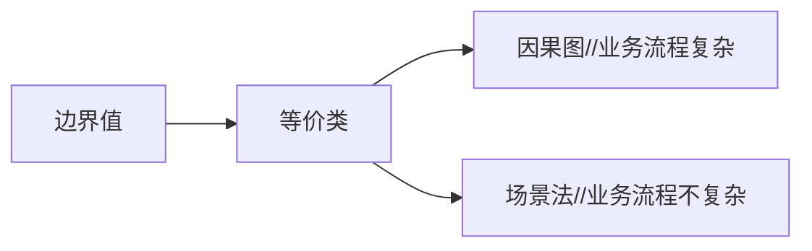

# 实践进阶

## 测试方法

测试用例（Test Case）是为特定的目的而设计的一组测试输入、执行条件和预期的结果，以便测试是否满足某个特定需求。通过大量的测试用例来检验软件的运行效果，它是指导测试工作进行的依据。

### 等价类划分法

* 用户所有可能输入的数据，划分成了若干份（或者也可以称为子集），然后从每一个子集当中选取少数具有代表性的数据作为测试用例，这种测试用例我们称为“等价类划分法”。
* 等价类划分是一种重要的、常用的黑盒测试方法，不需要考虑程序的内部结构，只需要考虑程序的输入规格即可。它将不能穷举的测试过程进行合理分类，从而保证设计出来的测试用例具有完整性和代表性。
* 等价类的分类：
  * 有效等价类：指符合《需求规格说明书》，输入合理的数据集合。
  * 无效等价类：指不符合《需求规格说明书》，输入不合理的数据集合。
* 等价类思考步骤
  1. 先确定有效和无效等价类
     * 如果输入条件规定了取值范围或值的个数，可以确定一个有效的等价类和两个无效的等价类。
     * 如果一个输入条件说明了“必须成立”的情况，则可划分一个有效等价类和一个无效等价类。
     * 如果输入条件规定了输入数据的一组可能值，而且程序是用不同的方式处理每一种值，则可以为每一种值划分一个有效的等价类，并划分一个无效的等价类。
     * 如果以划分的等价类中各子元素在程序中的处理方式不同，则应据此将此等价类进一步划分成更小的等价类。
     * 有效等价类就是题目条件（两端的极值（边界值）要判断、中间随意一个值也要判断）
     * 无效等价类先划分与条件相反的情况，再找到特殊情况（中文、英文、符号、空格、空）
  2. 确定等价类后，建立等价类表，列出所有划分的等价类。
  3. 明确测试对象，非测试对象保证正确。
  4. 为每个等价类规定一个唯一的编号。
  5. 设计一个测试用例，使其尽可能多的覆盖尚未覆盖的等价类。重复这一步，最后使得所有有效的等价类均被测试用例所覆盖。
  6. 每一个无效等价类对应一个测试用例。

### 边界值

* 大量的错误是发生在输入或输出范围的边界上，而不是在输入范围的内部。

  > 有效数据和无效数据的分界点，往往作为程序员编写程序的判断点，是程序员容易犯错误的地方，也是测试人员重点测试的内容。

* 边界是指对于输入等价类和输出等价类而言，稍高于其边界值及稍低于其边界值的一些特定情况。

* 边界值分析法也是一种常用的黑盒测试方法。

#### 边界值选择

1. 如果输入条件规定了值得范围，则应取刚到到这个范围的边界值，以及刚刚超越这个范围边界的值作为输入数据。
   * 两位整数加法器数的范围为-99—99，则应测试-99，-100和99，100
2. 输入条件规定了值得个数
   * 姓名要求1—20个字符，需要测试0、1、2个字符和19、20、21个字符
   * 某商品信息查询系统，每页最多显示10条商品信息，我们就应该准备商品信息，使能够查询出9、10条、11条、1条、0条商品记录
   * 边界值和等价类区别：边界值分析不是从某等价类中随便挑一个作为代表，而是这个等价类的每个边界都要作为测试条件

#### 常见边界值

* 文本框接收字符个数，比如用户名长度，密码长度等。
* 报表的第1行和最后1行。
* 数值元素的第1个和最后1个。
* 循环的第1次、2次和倒数第1次、2次。

### 因果图

因果图法是一种利用图解法分析输入的各种组合情况，从而设计测试用例的方法，它适合于检查程序输入条件的各种组合情况。

* 考虑输入条件的相互制约及组合关系
* 考虑输出条件对输入条件的依赖关系

#### 背景

* 等价类划分法和边界值分析方法都是着重考虑输入条件，但没有考虑输入条件的各种组合、输入条件之间的相互制约关系。这样虽然各种输入条件可能出错的情况已经测试到了，但多个输入条件组合起来可能出错的情况却被忽视了。
* 如果在测试时必须考虑输入条件的各种组合，则可能的组合数目将是天文数字，因此必须考虑采用一种适合于描述多种条件的组合、相应产生多个动作的形式来进行测试用例的设计，这就需要利用因果图（逻辑模型）。

#### 核心

因果图法比较适合输入条件比较多的情况，测试所有的输入条件的排列组合。所谓的原因就是输入，所谓的结果就是输出。

* 因果图的“因”（输入条件）。
* 因果图的“果”（输出结果）。

因果图法要注意考虑：

* 所有输入/输出条件的相互制约关系以及组合关系。
* 输出结果对输入条件的依赖关系，也就是什么样的输入组合会产生怎样的输出结果，即“因果关系”。

#### 步骤

利用因果图导出测试用例需要经过以下几个步骤:

1. 找出所有的原因，原因即输入条件或输入条件的等价类。
2. 找出所有的结果，结果即输出条件。
3. 明确所有输入条件之间的制约关系以及组合关系。哪些条件不能组合到一起，哪些条件可以组合到一起。
4. 明确所有输出条件之间的制约关系以及组合关系。哪些输出结果不能同时输出，哪些输出结果可以同时输出。
5. 找出什么样的输入条件组合会产生哪种输出结果
6. 把因果图转换成判定表/决策表。
7. 为判定表/决策表中的每一列表示的情况设计测试用例。

### 判定表

因果图只是一种辅助工具，通过分析最终得到判定表，再通过判定表编写测试用例。但有时画因果图非常麻烦，影响测试效率，可以直接写判定表，进而编写测试用例。

判定表的组成

* 条件桩：问题的所有条件
* 动作桩：问题的所有输出
* 条件项：针对条件桩的取值
* 动作项：条件项的各种取值情况下的输出结果

##### 步骤

1. 列出所有的条件桩和动作桩。
2. 填入条件项。
3. 填入动作项。得到初始判定表。
4. 简化判定表（合并相似规则（相同动作））
5. 合并使用`-`代表无关条件，选什么都不影响结果

### 场景法

场景法就是模拟用户操作软件时的场景，主要用于测试系统的业务流程。

* 当拿到一个测试任务时，不是先关注某个控件的边界值、等价类是否满足要求，而是先要关注它的主要功能和业务流程是否正确实现，这就需要使用场景法来完成测试。
* 当业务流程测试没有问题，也就是该软件的主要功能没有问题时，我们再重点从边界值、等价类等方面对控件进行测试。

在冒烟测试时也主要采用场景法进行测试。

##### 场景定义

* 基本流：按照正确的业务流程来实现的一条操作路径（模拟正确的操作流程）。
* 备选流：导致程序出现错误的操作流程（模拟错误的操作流程）。

### 流程分析法

流程分析法主要是针对测试场景类型属于流程测试场景的测试项下的测试子项进行设计，是从白盒测试设计方法中的路径覆盖分析法借鉴过来的一种方法。

* 在白盒测试中，路径就是指函数代码的某个分支组合，路径覆盖法需要构造足够的用例覆盖函数的所有代码路径。
* 在黑盒测试中，若将软件系统的某个流程看成路径的话，则可以针对该路径使用路径分析的方法设计测试用例。
* 降低了测试用例设计难度，只要搞清楚各种流程，就可以设计出高质量的测试用例来，而不需要太多测试方面的经验。
* 在测试时间较紧迫的情况下，可以有的放矢的选择测试用例，而不用完全根据经验来取舍。

#### 步骤

1. 详细了解需求；
2. 根据需求说明或界面原型，找出业务流程的各个页面以及各页面之间的流转关系；
3. 画出业务流程（产品经理使用Axure软件制作）；
4. 写用例，覆盖所有的路径分支。

### 错误推测法

错误推测法是指利用直觉和经验猜测出错的可能类型，有针对性列举出程序中所有可能的错误和容易发生错误的情况。

* 列举出可能犯的错误或错误易发生的清单，然后根据清单编写测试用例。
* 这种方法很大程度上是凭经验进行的，即凭人们对过去所作测试结果的分析，对所揭示缺陷的规律性作直觉的推测来发现缺陷。

### 正交法

* 正交排列法能够使用最小的测试过程集合获得最大的测试覆盖率。
* 当可能的输入数据或者输入数据的组合数量很大时，由于不可能为每个输入组合都创建测试用例，可以采用这种方法。
* 思想：从所有组合集合中选取测试数据时，应该均匀的选取其中的组合作为测试用例，而不要只在某个局部选取数据。

#### 正交实验设计

* 研究多因素多水平的一种设计方法。
* 它是根据正交性从全面试验中挑选出部分有代表性的点进行试验，这些有代表性的点具备了“均匀分散，齐整可比”的特点。
* 正交试验设计是一种基于正交表的、高效率、快速、经济的试验设计方法。

#### 概念

正交表：一种特制的表，一般的正交表记为$L_n(m^K)$

* $n$是表的行数，也就是需要测试组合的次数
* $K$是表的列数，表示控件的个数（因素的个数，或因子个数）
* $m$是每个控件包含的取值个数（各因素的水平数，即各因素的状态数）
* 如：$L_9（3^4）$，有4个控件，每个控件有3个取值，9为需要测试的组合个数，叫4因素3水平。

> 查找正交表：–数理统计、试验设计等方面的书及附录中。
>
> 正交排列表是经过严格的数学推理得来的。
>
> 可以使用正交表生成工具。

#### 步骤

1. 根据所测程序中控件的个数（因素）以及每个控件的取值个数（水平），选取一个合适的正交排列表
2. 把控件及其取值列举出来，并对其进行编号
3. 把控件及其取值映射到正交排列表中
4. 把正交排列表中的ABCD（因子）分别替换成4个控件
5. 把每列中的1、2、3（状态）分别换成这个控件的3个取值（水平），排列顺序要按照表中给出的顺序
6. 根据映射好的正交排列表编写测试用例

### 测试方法的选择

1. 根据程序的重要性和一旦发生故障将造成的损失来确定测试等级和测试重点。
2. 认真选择测试策略，以便能尽可能少的使用测试用例，发现尽可能多的程序错误。因为一次完整的软件测试过后，如果程序中遗留的错误过多并且严重，则表明该次测试是不足的，而测试不足则意味着让用户承担隐藏错误带来的危险，但测试过度又会带来资源的浪费。因此测试需要找到一个平衡点。

#### 选择步骤

1. 拿到一个测试任务时，先关注它的主要功能和业务流程、业务逻辑是否正确实现，考虑使用场景法。
2. 需要输入数据的地方，考虑采用等价类划分法，包括输入条件和输出条件的等价划分，将无限测试变成有限测试。
3. 在任何情况下都必须采用边界值分析法。这种方法设计出的测试用例发现程序错误的能力最强。
4. 如果程序的功能说明中含有输入条件的组合情况，则一开始就应考虑选用因果图和判定表法。
5. 对于参数配置类的软件，需要考虑参数之间的组合情况，考虑使用正交排列法选择较少的组合方式（最少的测试用例获得最大的的测试覆盖率）。
6. 对照程序逻辑，检查已设计出的测试用例的逻辑覆盖程度。如果没有达到要求的覆盖标准，则应当再补充更多的测试用例。
7. 采用错误推断法再追加测试用例——依靠测试工程师的经验和智慧。

## 测试用例设计

### 思考顺序

## 白盒测试

### 代码审查

合规代码：正确性、清晰性、规范性、一致性、高效性

审查的内容：

1. 业务逻辑审查
2. 算法效率
3. 代码风格
4. 编程规则
5. 程序性能
   1. 减少对象创建
   2. 减少循环体执行
   3. 提高异常处理出错的效率
   4. 减少I/O操作

### 单元测试

单元测试的对象是构成软件产品或系统的最小独立单元，如封装的类对象、独立函数、进程、子过程、组件或模块等。

#### 单元测试用例设计

对于单元测试用例的设计和程序的实现过程，主要集中在白盒测试方法之上，并力求达到下列测试要求

1. 对程序模块所有的执行路径至少测试一次。
2. 对所有逻辑判定，其结果为真、假两种情况至少测试一次。
3. 对程序边界检查（常见的数据越界检查）。
4. 检验内部数据结构的有效性。

#### 单元测试的主要方法

* 逻辑覆盖法
  * 语句覆盖：设计若干测试用例，运行被测程序，使程序中每个可执行语句至少被执行一次。
  * 判定覆盖：使每个判断取真值和取假值都至少经历一次。
  * 条件覆盖：使得每个条件的取真值和取假值都至少经历一次。
  * 判定-条件覆盖：设计足够的测试用例，可以使得所有的条件至少被执行一次；同时，所有判断的结果也至少被执行一次。
  * 条件组合覆盖：设计足够的测试用例，使得判断中每个条件所有的可能至少出现一只，并且每个判断本身的判定结果也至少出现一次。与判定条件覆盖的差别是，条件组合覆盖不是简单的要求每个条件都出现”真“与”假“两种结果，而是要求让这些结果所有可能组合都至少出现一次。

## 自动化测试

项目自动化测试的条件：

1. 需求变更有计划性，且频率不高。
2. 项目周期长，资源丰富。
3. 脚本重复利率。
4. 代码规范。

自动化测试场景

* 基础性代码更适合自动化测试。
* 繁杂的业务逻辑更适合手工测试。

## 安全测试

owap 10大安全漏洞

1. 注入
2. 失效的身份认证和会话管理
3. 跨站脚本
4. 失效的访问控制
5. 安全配置错误
6. 敏感信息泄露
7. 跨站请求伪造
8. 使用含有已知漏洞的控件
9. 攻击检测和防范不足
10. 未受保护的apis

### 安全测试流程

## 性能测试

性能测试主要是描述测试对象月性能相关的特征，并对其进行评价而实施和执行的一类测试。

* 主要是通过自动化测试工具模拟多种正常、峰值以及异常负载条件下来对系统各项性能指标进行的测试。

性能测试主要内容

* 评估生成准备状态
* 评估性能判断标准
* 比较不同系统或同一系统不同配置之间的性能特征
* 找出导致性能问题的源头
* 帮助进行系统性能调优
* 确定吞吐量水平

### 性能测试的步骤

1. 确定测试环境
   * 物理环境、生产环境、测试团队可利用的工具和资源。
2. 确定性能验收标准
   * 确定响应时间、吞吐量、资料利用中目标和限制。
3. 计划和设计测试
   * 确定关键场景。
   * 确定典型用户的可变性，以及如何模拟这些变化。
   * 确定测试数据。
   * 确定需要手机的度量值。
4. 配置测试环境
   * 随着需要测试的功能和组件对的完善，逐步为每个策略准备执行所需的测试环境、工具以及资源。
5. 实现测试设计
   * 根据测试设计逐步展开性能测试。
6. 执行测试
   * 执行和监控测试。
7. 分析结果、报告已经重复测试
   * 整合并共享结果数据。

### 性能测试目标

* 评估软件发布准备

* 评估基础结构是否恰当
* 评估已开发软件的性能是否满足要求
* 提高性能调整效率

### 性能测试的分类

* 负载测试：确定系统在满足性能指标下，系统能够承受的最大负载；通过逐步增加压力来确定系统能够承受的各项阈值。
* 压力测试：确定系统在某些超过实际运行阶段所预期的条件下时所具备的性能特性；使某些系统资源达到饱和甚至失效的测试。
* 容量测试：在满足性能目标的前提下，确定系统可以处理同时在线的最大用户数。
* 其他
  * 配置测试：通过对硬件的配置，找到系统各项资源的最优分配。
  * 并发测试：测试多个用户同时访问同一个应用、同一个模块或数据记录时，是否存在死锁或者其他性能问题。
  * 可靠性测试：通过给系统加载一定的业务压力情况下，运行一段时间，检查系统是否稳定。通常可以测试出系统是否有内存泄露等问题。
  * 稳定性测试：在复杂多变的环境下，系统所能提供的总体可靠性、健壮性、功能和数据完整性、有效性以及响应的连续性。

### 性能测试工具

* LoadRunner新能测试工具

## 移动App测试

### App测试方法

* 功能测试
  * 登录测试
    * 注册测试：本地注册、快速注册
    * 注销测试
    * 登录测试：多终端登录、第三方登录
  * 运行测试
  * 切换测试：后台切换、删除进程、锁屏
  * 推送测试
  * 更新测试：手动刷新、自动刷新
* 专项测试：安装、卸载等
* 稳定性测试
* 兼容性测试
* UI测试

### App测试自动化工具

* appuim是一个开源、跨平台的开源测试框架，可以用来测试原始及混合的移动应用，支持iOS、Android和FireFoxOS平台测试。
* 性能和稳定性测试工具：Monkey。
* App云测试平台。

