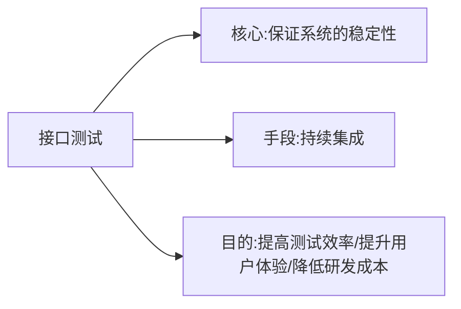
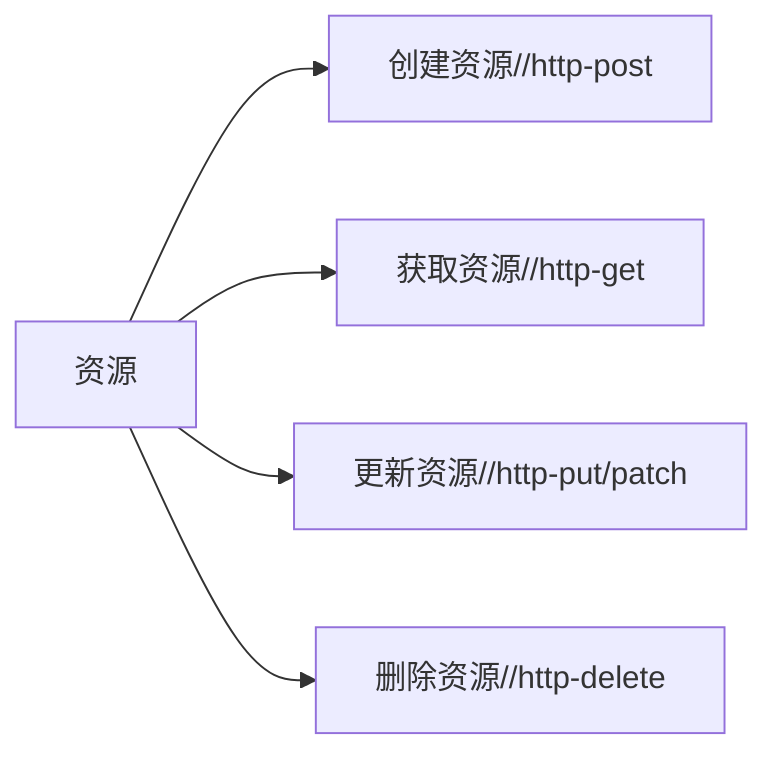

# 自动化测试

## Python自动化测试框架

基于 Python 语言的自动化测试框架，最知名的有如下 3 款

- unittest
- pytest
- robotframework

前两款框架主要（或者说很大程度上）是聚焦在白盒单元测试，而robotframework主要聚焦在系统测试。

### pytest特点

pytest 可以用来做系统测试的自动化，它的特点有

- 用 Python 编写测试用例，简便易用
- 可以用 文件系统目录层次对应手工测试用例层次结构
- 灵活的初始化清除机制
- 可以灵活挑选测试用例执行
- 利用第三方插件，可以生成不错的报表


## pytest

### 安装

安装命令`pip install pytest`

生测试报表，第三方插件`pip install pytest-html`

### 快速上手

#### 项目结构和命名规则

测试用例代码文件， 必须以 `test_` 开头，或者以 `_test` 结尾。比如，创建一个 文件名为 `test_错误登录.py` ，放在目录 `autotest\cases\登录` 下面。

从这些文件中，收集如下测试项：

* test为前缀的函数
* Test为前缀的类里面的test为前缀的方法

```python
class Test_错误密码:
    def test_C001001(self):
        print('\n用例C001001')
        assert 1 == 1
        
    def test_C001002(self):
        print('\n用例C001002')
        assert 2 == 2
        
    def test_C001003(self):
        print('\n用例C001003')
        assert 3 == 2
```

#### 运行pytest

进入自动化项目根目录，执行命令程序 `pytest`

如果希望显示测试代码中print的内容，可以加上命令行参数`pytest -s`

如果希望得到更详细的执行信息，包括每个测试类、测试函数的名字，可以加上参数-v，这个参数可以和-s合并，`pytest -sv`

#### 产生测试报告

安装了 pytest-html 插件，这个插件就是用来产生测试报告的。

要产生报告，在命令行加上 参数 `--html=report.html --self-contained-html` ，如下

```shell
pytest cases --html=report.html --self-contained-html
```

### 初始化清除

模块级别

* 模块级别的初始化、清除分别在整个模块的测试用例 执行前后执行，并且 只会执行1次 。

* 主要是用来为该模块中所有的测试用例做公共的初始化和清除。

类级别

* 类级别的初始化、清除分别在整个类的测试用例执行前后执行，并且只会执行1次。

方法级别

* 方法级别的初始化、清除分别在类的每个测试方法执行前后执行，并且每个用例分别执行1次。

```python
def setup_module():
    print('\n *** 初始化-模块 ***')

def teardown_module():
    print('\n ***   清除-模块 ***')

class Test_错误密码:
    @classmethod
    def setup_class(cls):
        print('\n === 初始化-类 ===')

    @classmethod
    def teardown_class(cls):
        print('\n === 清除 - 类 ===')
        
    def setup_method(self):
        print('\n --- 初始化-方法  ---')

    def teardown_method(self):
        print('\n --- 清除  -方法 ---')
        
    def test_C001001(self):
        print('\n用例C001001')
        assert 1 == 1
        
    def test_C001002(self):
        print('\n用例C001002')
        assert 2 == 2
        
    def test_C001003(self):
        print('\n用例C001003')
        assert 3 == 2

class Test_错误密码2:
    def test_C001021(self):
        print('\n用例C001021')
        assert 1 == 1
        
    def test_C001022(self):
        print('\n用例C001022')
        assert 2 == 2
```

目录级别

* 目标级别的初始化清除，就是针对整个目录执行的初始化、清除。

* 需要初始化的目录下面创建一个名为 `conftest.py` 的文件，里面内容如下所示
* 可以在多个目录下面放置这样的文件，定义该目录的初始化清除。pytest 在执行测试时，会层层调用。

```python
import pytest 

@pytest.fixture(scope='package', autouse=True)
def st_emptyEnv():
    print(f'\n#### 初始化-目录甲')
    yield # yield之前的代码是初始化代码，后面的代码是清除代码
    
    print(f'\n#### 清除-目录甲')
```

### 挑选测试用例执行

指定模块

```shell
pytest cases\登录\test_错误登录.py
```

指定目录

```shell
pytest cases
```

指定多个子目录

```shell
pytest cases1  cases2\登录
```

指定一个类

```shell
pytest cases\登录\test_错误登录.py::Test_错误密码
```

指定一个方法

```shell
pytest cases\登录\test_错误登录.py::Test_错误密码::test_C001001
```

#### 根据名字挑选

可以使用命令行参数-k后面加名字来挑选要执行的测试项，比如像这样后面跟测试函数名字的一部分：

```shell
pytest -k C001001 -s
```

注意，-k 后面的名字

* 可以是测试函数的名字，可以是类的名字，可以是模块文件名，可以是目录的名字
* 是大小写敏感的
* 不一定要完整，只要能有部分匹配上就行
* 可以用 not 表示选择名字中不包含，比如

```shell
pytest -k "not C001001" -s
```

* 可以用 and 表示选择名字同时包含多个关键字，比如

```shell
pytest -k "错 and 密码2" -s
```

* 可以用or表示选择名字包含指定关键字之一即可，比如

```shell
pytest -k "错 or 密码2" -s
```

#### 根据标签

可以这样给 某个方法加上标签 webtest

```python
import pytest

class Test_错误密码2:

    @pytest.mark.webtest
    def test_C001021(self):
        print('\n用例C001021')
        assert 1 == 1
```

运行指定标签的用例

```shell
pytest cases -m webtest -s
```

可以这样给整个类加上标签

```python
@pytest.mark.webtest
class Test_错误密码2:

    def test_C001021(self):
        print('\n用例C001021')
        assert 1 == 1
```

标签支持中文

```python
@pytest.mark.网页测试
class Test_错误密码2:

    def test_C001021(self):
        print('\n用例C001021')
        assert 1 == 1
```

运行命令行指定标签

```shell
pytest cases -m 网页测试 -s
```

可以这样同时添加多个标签

```python
@pytest.mark.网页测试
@pytest.mark.登录测试
class Test_错误密码2:

    def test_C001021(self):
        print('\n用例C001021')
        assert 1 == 1
```

可以这样定义一个全局变量 pytestmark 为整个模块文件设定标签

```python
import pytest
pytestmark = pytest.mark.网页测试
```

如果需要定义多个标签，可以定义一个列表

```python
import pytest
pytestmark = [pytest.mark.网页测试, pytest.mark.登录测试]
```

### 数据驱动

使用pytest用例的数据驱动格式，只需如下定义即可

```python
class Test_错误登录:
    @pytest.mark.parametrize('username, password, expectedalert', [
        (None, '88888888', '请输入用户名'),
        ('byhy', None, '请输入密码'),
        ('byh', '88888888', '登录失败 : 用户名或者密码错误'),
        ('byhy', '8888888', '登录失败 : 用户名或者密码错误'),
        ('byhy', '888888888', '登录失败 : 用户名或者密码错误'),
    ]
                             )
    def test_UI_0001_0005(self, username, password, expectedalert):
        alertText = loginAndCheck(username, password)
        assert alertText == expectedalert
```


## 数据驱动

数据的改变从而驱动自动化测试的执行，最终引起测试结果的改变。其实就是将测试用例参数化，数据驱动的本质就是“测试数据”与“执行代码”做分离。“测试数据”一般保存在txt、excel、csv和yaml中。

1. 数据在实际的测试中是有多组进行测试的。
2. 每个测试用例对应一组测试数据。

一个测试用例包括

* 测试步骤：测试步骤通过UnitTest管理
* 测试数据：通过Yaml管理

### Yaml代码与数据分类

#### Yaml介绍

Yaml是一种置标语言，类似xml。

* 缩进。
* 能够实现各种类型的数据展示：字典、集合、string int float。yaml有类型猜测，但是数据可能猜测错误。
* 可以作为测试数据的提供对象，自动化测试中代码与数据的分离，代码分为对象库与测试代码、数据。
* Yaml可以与ddt完美结合，所以可以与UnitTest完美结合。

#### 环境搭建

`pip install pyyaml`

#### Yaml类型

* 字符串类型`!!str`
* 整数类型
* 浮点类型`!!float`
* 布尔类型`true`，`false`
* 日期时间
* 空数据

#### Yaml格式

* `-`表示集合
* `key: value` 字典

```yaml
%yaml 1.2 # 遵循yaml 1.2
-
	username: 666666
	pwd: !!str 111111 # !!str强制类型转换为string
	score: 13.0 # !!float 13.0 类型更清楚
	male: true
	book: null
	birthday: 1986-11-11 11:11:11 # 转换为某种语言的时间日期格式
	interest: # 数组
		- baskball
		- football
	friends: # 数组对象
		- name: foo1
			age: 14
		- name: foo2
			age: 15
	relations:
		father: foo3
		mother: foo4
	comment: > # 在字符串后面添加回车
		qqw
		aaa
	comment1: | # 在字符串每一行后面都添加了回车
		qqw
		aaa
	
demo: &demo 
	sexual: male

website_login:
	name: a
	age: 30
	sexual: &sexual male # 设置锚点，通过设置锚点值可以引用url等通用数据，类似指针的表达方式
	
website_order:
	name: b
	age: 30
	sexual: *sexual # 引用锚点值
	
API_goodsdetail:
	name: c
	age: 30
	<<: *demo # 引用锚点的多个值
	
--- # 表示另一个文件
... # 表示文件结束
```

#### Yaml的读取

```python
import yaml

file = open('data.yaml', encoding='utf-8')
result = yaml.load(file, Loader=yaml.FullLoader)
print(yaml)
```

### ddt中yaml使用

```python
import unittest
from ddt import ddt, file_data

@ddt
class UnitYaml(unittest.TestCase):
    # 读取yaml文件中的数据，并传入测试用例
    @file_data('data.yaml')
    def test1(self, **kwargs):
        username = kwargs.get('username')
        pwd = kwargs.get('pwd')
```


## 关键字驱动


## 接口测试

### 入门

> 接口测试：接口测试就是通过测试不同情况下的输入参数与之对应的输出参数信息来判断接口是否符合或满足相应的功能性、安全性要求。

接口测试在单元测试之后，在UI测试之前。

#### 接口测试的价值

* 更容易实现持续集成
* 自动化测试落地性价比更高，比UI更稳定
* 大型系统更多更复杂，系统间模块越来越多
* 可以发现很多在页面上操作发现不了的bug
* 检测系统的异常处理能力
* 检测系统的安全性、稳定性
* 前端随便变更，接口测试好了，后端不用变

#### 接口测试的目标



#### 接口测试的分类


#### 接口测试要点

* 监测数据的交换
* 传递和控制管理过程
* 系统间的相互逻辑依赖关系

#### Rest接口概念

一种软件架构风格，可以降低开发的复杂性，提高系统的可伸缩性。将client和server进一步解耦。

核心思想是资源，使用对于的请求操作资源。



| 操作           | 描述                                       |
| -------------- | ------------------------------------------ |
| head(select)   | 只获取某个资源的头部信息                   |
| get(select)    | 获取资源                                   |
| post(create)   | 创建资源                                   |
| patch(update)  | 更新资源部分属性                           |
| put(update)    | 更新资源，客户端需要提供新建资源的所有属性 |
| delete(delete) | 删除资源                                   |

##### 测试规范

协议：使用https协议，确保交换数据的传输安全。

域名：应该尽量将api部署在专用域名之下。`https://api.example.com`

版本控制：将版本号放在url或者header中。

路径：只包含名称，不包含动词。

##### 常见状态码

| 代码 | 含义                   | 说明                               |
| ---- | ---------------------- | ---------------------------------- |
| 200  | ok                     | 资源被更改，查询成功               |
| 201  | crated                 | 新资源创建成功                     |
| 202  | accepted               | 已接受处理请求但尚未完成(异步处理) |
| 301  | moved permanently      | 资源URI被更新                      |
| 303  | see other              | 其他                               |
| 400  | bad request            | 错误                               |
| 404  | not found              | 资源不存在                         |
| 406  | not acceptable         | 服务端不支持所需表示               |
| 409  | conflict               | 通用冲突                           |
| 412  | precondition failed    | 前置条件失败(如执行条件更新时冲突) |
| 415  | unsupported media type | 接受错误媒体类型                   |
| 500  | internal server error  | 通用错误响应                       |
| 503  | service unavailable    | 服务当前无法处理请求               |

##### 返回结果

返回结果设计

```json
{
  "msg": "错误提示信息",
  "code": 404,
  "requset": "GET "
}
```

##### 测试步骤


### 接口测试的用例设计

- 依据接口规范，写出测试用例。
- 使用软件工具，直接通过消息接口对被测系统进行消息收发。
- 验证被测系统行为是否正确。

#### 接口测试的范围

功能测试

* 等价类划分法
* 边界值分析法
* 错误推断法
* 因果图法
* 判断表驱动法
* 正交试验法
* 功能图法
* 场景法

异常测试

* 数据异常：null/""(空字符串)/数据类型
* 环境异常：负载均衡架构/冷热备份

性能测试

* 负载测试
* 压力测试或强度测试
* 并发测试
* 稳定性测试或可靠性测试

##### 功能测试

覆盖范围：

* 业务流程
* 边界值、特殊符号
* 参数类型、必选项、可选项等

编写测试用例的时候，通常可以采用条件组合、边界值、错误猜测等方法。

* 列出所有可能影响系统行为的条件组合，设计测试用例
* 针对每种输入设计边界值条件

#### 自动化接口测试范围

$$
功能测试+数据异常测试
$$

#### 实战用例设计

##### 一般接口案例

接口测试用例映射为一张表格

> 测试案例
>
> 输入：用户名(邮箱或手机号)
>
> 输入：密码(6到16位长度，区分大小写，不能用空格)

| id   | 目标url                      | 用户名(username) | 密码(password) | 状态码 | 返回内容 | 结果 | 执行状态 |
| ---- | ---------------------------- | ---------------- | -------------- | ------ | -------- | ---- | -------- |
| 1    | http://localhost:8080/login/ | tom@qq.com       | 123456         | 200    | success  |      |          |
| 2    |                              | 13111112222      | 123456         | 200    | success  |      |          |
| 3    |                              | null             | Null           |        |          |      |          |
|      |                              | null             | ""             |        |          |      |          |

##### Rest案例

请求

* get 请求列表页 
  * header: content-type=application/json
  * body: none
  * response: 返回所有user对象
  * status code: 200

* get 请求详情页
  * header: content-type=application/json
  * body: none
  * response: 返回指定id的user对象
  * status code: 200

* post 请求添加记录
  * header: content-type=application/json
  * body: name; age; salary; 添加新值
  * response: 添加user对象
  * status code: 201

* put 请求修改信息
  * header: content-type=application/json
  * body: name; age; salary; 添加新值
  * response: 修改user对象
  * status code: 200

* delete 删除操作
  * header: content-type=application/json
  * body: none
  * response: 删除id的user对象
  * status code: 204

错误

* code 4 message: 找不到指定对象
* code 5 message: 对象已经存在
* code 6 message: 参数不匹配

测试计划

* get 请求
  * 正向用例：返回所有对和返回某一个对象
  * 负向用例：
    * 一个不存在的id 
    * url输入不正确
* post 请求
  * 正向用例：输入正确的参数新加一个对象（特殊字符，中文）
  * 负向用例：
    * 参数name为空/重复
    * 参数age为0/-1/100/101/字符串/null/空
    * 参数salary为整数/带小数/负数/null/空
* put 请求
  * 正向用例：输入一个正确的参数修改一个对象
  * 负向用例：
    * 参数id为空/无效值
    * 参数name为空/重复
    * 参数age为0/-1/100/101/字符串/null/空
    * 参数salary为整数/带小数/负数/null/空
* delete 请求
  * 正向用例：删除某一个对象
  * 负向用例：
    * 一个不存在的id
    * url不正确