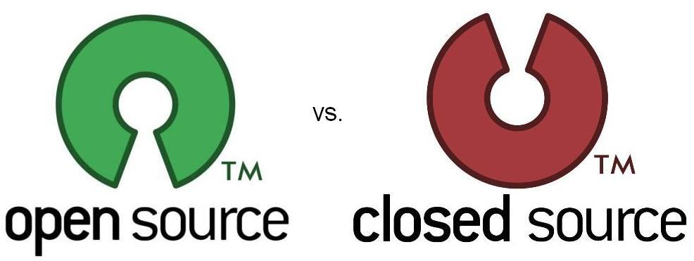

# Github

##  什么是开源

开源软件：开放源代码

* 源代码是公开的
* 任何人都可以去查看，修改和使用开源代码

闭源软件：软件的代码是封闭的

* 只有作者能看到闭源软件的代码
* 只有作者能对源代码进行修改

### 开源许可协议

开源并不意味着完全没有限制，为了限制使用者的使用范围和保护作者的权利，每个开源项目都应该遵守开源许可协议（ Open Source License ）。

常见的 5 种开源许可协议：

* BSD（Berkeley Software Distribution）
* Apache Licence 2.0
* GPL（GNU General Public License）
  * 具有传染性的一种开源协议，不允许修改后和衍生的代码做为闭源的商业软件发布和销售
  * 使用 GPL 的最著名的软件项目是：Linux
* LGPL（GNU Lesser General Public License）
* MIT（Massachusetts Institute of Technology, MIT）
  * 是目前限制最少的协议，唯一的条件：在修改后的代码或者发行包中，必须包含原作者的许可信息
  * 使用 MIT 的软件项目有：jquery、Node.js

[各种开源协议介绍](https://www.runoob.com/w3cnote/open-source-license.html)

### 开源软件的优势

1. 开源给使用者更多的控制权。
2. 开源让学习变得容易。
3. 开源才有真正的安全。

开源使软使在每个开发者的工作都可以在前任的基础上进行，不用自己重复造轮子，让开发越来越容易。

### 开源项目托管平台

专门用于免费存放开源项目源代码的网站，叫做开源项目托管平台。目前世界上比较出名的开源项目托管平台主要有以下 3 个：

*  [Github](https://github.com/)全球最大的开源项目托管平台，没有之一
* [Gitlab](https://gitlab.cn/)针对企业用户的代码托管平台
* [Gitee](https://gitee.com/)国产的开源项目托管平台

> [!warning]
>
> 以上3个开源项目托管平台，只能托管以Git管理的项目源代码。
